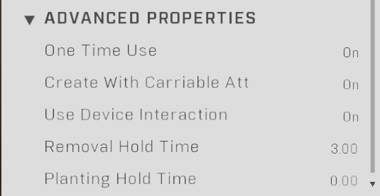
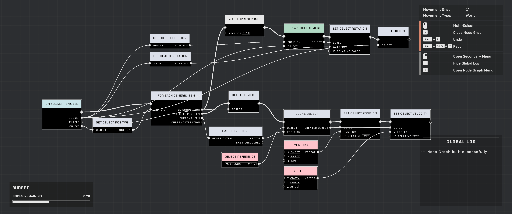

# Power Sockets as Interactive Switches

<figure><figcaption></figcaption></figure>

Power Sockets can be utilized as a type of interactive switch. By treating the removal of a Power Seed as an interaction event, creators can build switch systems that bypass the direct reference requirements often associated with standard scriptable objects.

## Implementation

To use a Power Socket as a switch, the "Create With Carriable Attached" option must be enabled in the object properties. This ensures a Power Seed is present when the object is placed.

### Configuration

The interaction is detected using the [On Socket Removed](../../../scripting/nodes/events-generic-objectives/on-socket-removed.md) node. This node triggers when a player picks up the Power Seed, allowing the script to proceed with the intended switch logic.

<figure><figcaption>
The advanced properties of a Power Socket allow for interaction timer customization.
</figcaption></figure>

#### Resetting the Switch

To allow a switch to be used multiple times, the Power Socket can be reset after the interaction. Once the On Socket Removed event is triggered, the script can delete the Power Seed and use the [Spawn Mode Object](../../../scripting/nodes/game-mode/spawn-mode-object.md) node to replace the original Power Socket with a fresh copy.

<figure><figcaption>
This script detects when the Power Seed is removed to trigger the reset sequence.
</figcaption></figure>


Newly placed Power Sockets may require "priming" due to a known bug. To ensure the socket respects the Removal Hold Time, Planting Hold Time, and scripting nodes, switch the "Use Device Interaction" setting Off and then back On.


## Comparison with Scriptable Switches

Using Power Sockets offers several advantages over the dedicated Scriptable Switch object:

* **Mass Deployment**: Unlike the [On Object Interacted](../../../scripting/nodes/events-custom/on-object-interacted.md) node, which typically requires a direct reference to a specific switch, Power Sockets bypass this requirement. This allows them to be mass-deployed via the Spawn Mode Object node while still functioning as unique, individual switches.
* **Interaction Timing**: Power Sockets allow creators to define the duration required to activate the switch.
* **Reset Behavior**: The method allows for customized reset behavior through scripting.

## Constraints and Known Issues

While versatile, this method has specific limitations and potential reliability concerns.

### Interaction Requirements

Power Sockets rely on the ability to pick up weapons to function. Consequently, this method may not work as intended if the Weapon Pickup trait is disabled or if Object Filters are used to restrict access. This can be a concern when attempting to restrict switch access to specific players or teams.

### Reliability and Bugs

* **Prompt Consistency**: Depending on the orientation of the Power Socket, the "Take Power Seed" prompt may occasionally be inconsistent.
* **Cloning Issues**: There have been reports of Spawn Mode Object clones failing to appear correctly in the Object List, which may prevent the deletion or reset events from running reliably.

***

## Source Data

* Discord thread: [Power Sockets as Interactive Switches](https://discord.com/channels/220766496635224065/1474550605103104063/1474550605103104063)

#### <mark style="color:green;">Contributors</mark>

Toast\
Okom