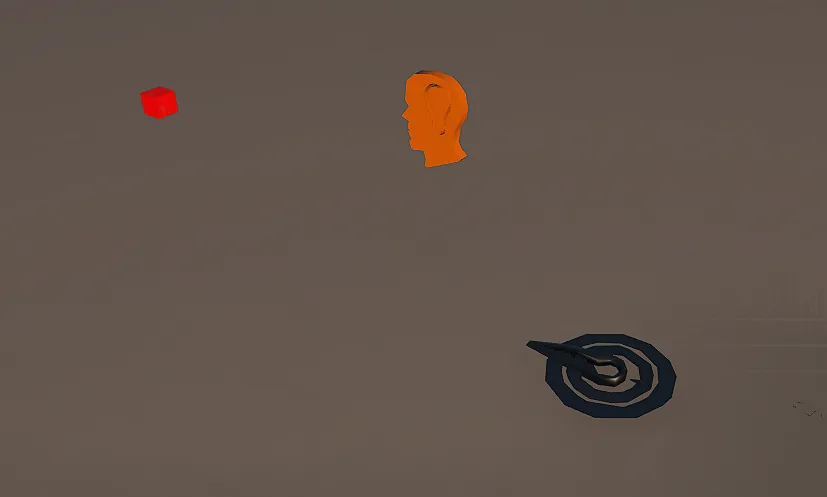
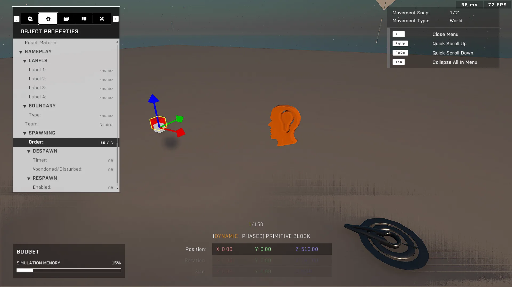

# Spawn Mode Object Node In On-Level Brain Doesn't Work If Map Loaded With a Forge Mode

<figure><figcaption></figcaption></figure>

When using the [Spawn Mode Object](../../../scripting/nodes/game-mode/spawn-mode-object.md) node within an on-level `Mode Brain`, spawning fails to clone objects if the map is loaded via a custom Forge Mode, such as a Minigame variant constructed from empty brains. This issue does not occur when playing through official game modes.

## Spawning Discrepancy in Custom Modes

In some scenarios, scripts intended to duplicate existing on-level assets will fail depending on how the session was initialized. 

### Behavior in Official Game Modes
When a map is played using an official mode (e.g., "Arena:Slayer"), `Spawn Mode Object` functions as expected because it maintains valid object references that load correctly upon match start. In this state, cloning succeeds and relevant data is recorded in the killfeed.

<figure><figcaption></figcaption></figure>

### Behavior in Custom Forge Modes
If the map is loaded via a custom Forge Mode, such as a Minigame variant made of two empty `Mode Brain` nodes, the cloning process fails. During these sessions, the killfeed indicates that the output object is not valid and no clone appears in the world.


Spawning logic using `Spawn Mode Object` may fail when executing within a custom Forge Mode or Minigame variant even if the script functions correctly during standard Play Mode tests.
{% endhint }



Spawning logic using `Spawn Mode Object` may fail when executing within a custom Forge Mode or Minigame variant even if the script functions correctly during standard Play Mode tests.
{% endhint }

## Reproduction Steps

There are two documented methods to reproduce this issue for testing and debugging purposes.

### Method 1: Comparison of Game Modes
* **Official Mode (Success):** Load a map containing target objects using an official mode like "Arena:Slayer". Verify the red Primitive Block clones correctly and triggers killfeed entries. [Map Link](https://www.halowaypoint.com/halo-infinite/ugc/maps/8e5803c2-27fc-498e-864c-483304d87990)
* **Forge Mode (Failure):** Load the same map using a custom Forge Mode [such as this Minigame variant](https://www.halowaypoint.com/halo-infinite/ugc/modes/c38cd73c-5a5e-4582-aa89-50af710edc65). Observe that the object fails to clone and returns an invalid object error in the killfeed.

### Method 2: Variable Spawn Order Debugging
* Place a `Primitive Block` (Spawn Order: 50) and a `Mode Brain` (Spawn Order: 5) on an empty Void canvas in Forge.
* Create a node graph with the `Spawn Mode Object` node; confirm that it prints expected values during standard Forge Play Mode testing.
* Place two additional `Mode Brains` into the scene, assigning one a Spawn Order of 10 and the other a Spawn Order of 20.
* Select both brains to create a "Minigame" variant `Mode Prefab`, then delete the prefab and save the map.
* Load the saved map using the custom Forge mode created in step 4; observe that spawning fails under this loading configuration compared to official modes.

<figure><figcaption></figcaption></figure>

***

## Source Data

* Discord thread: [Spawn Mode Object Node In On-Level Brain Doesn't Work If Map Loaded With a Forge Mode](https://discord.com/channels/220766496635224065/1535589156984725625/1535589156984725625)

#### <mark style="color:green;">Contributors</mark>

Okom