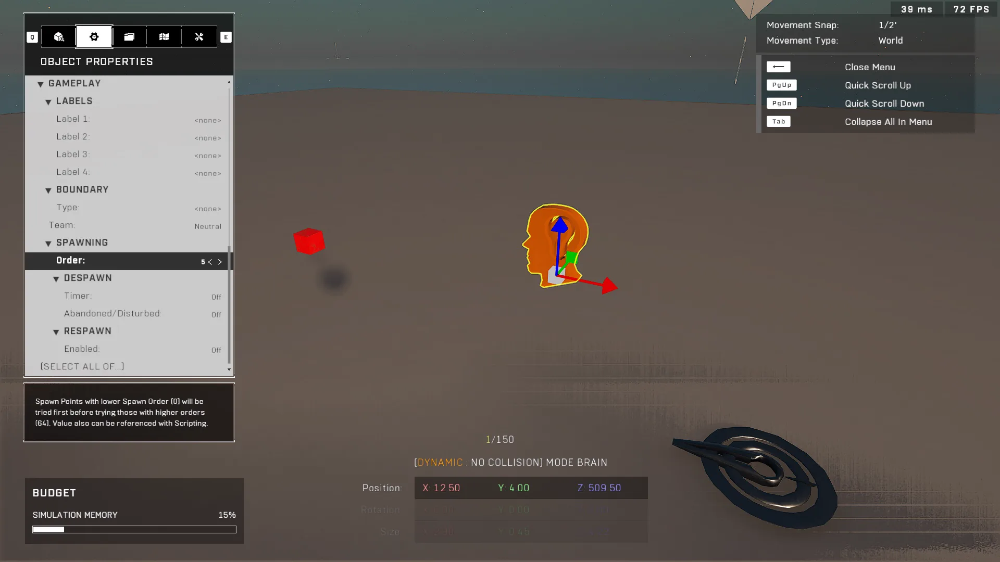
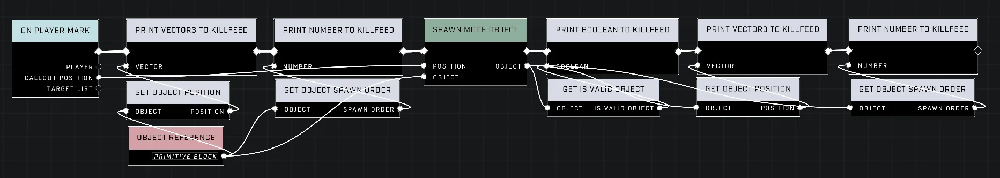
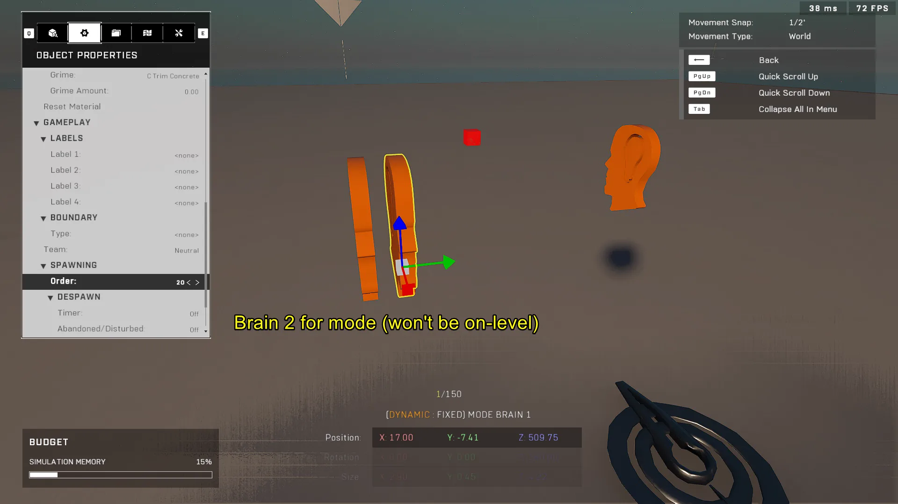
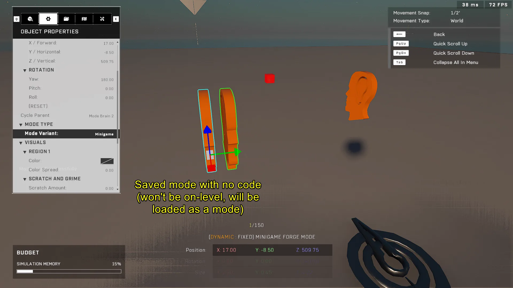
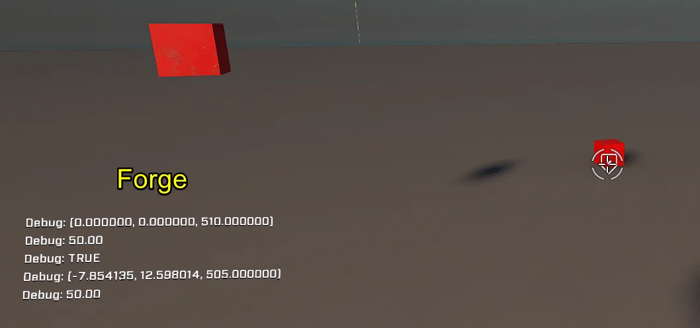
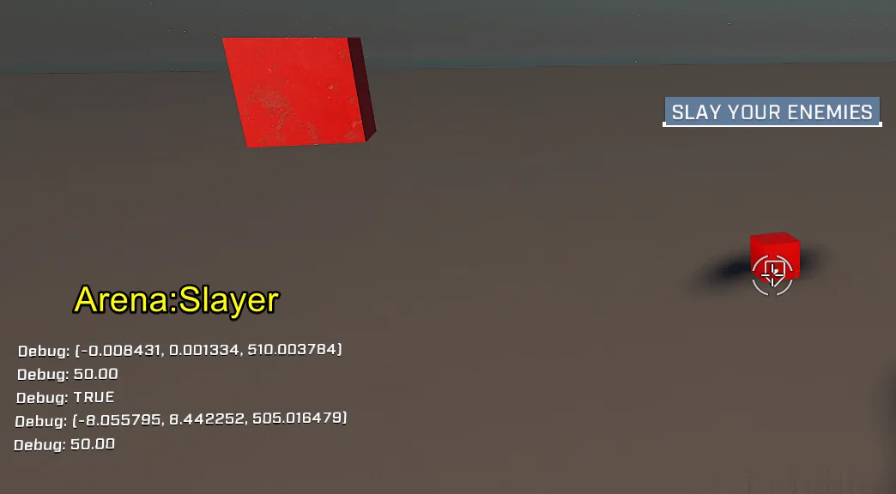
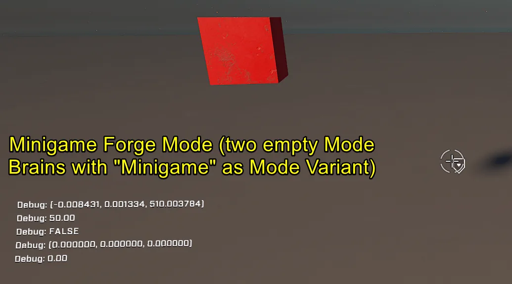

# Spawn Mode Object Node In On-Level Brain Doesn't Work If Map Loaded With a Forge Mode

A bug has been identified where scripts in an on-level `Mode Brain` that utilize the [Spawn Mode Object](../../../scripting/nodes/game-mode/spawn-mode-object.md) node fail to clone any object if the map is played via a custom game loaded with a Forge Mode. This specifically occurs when using modes like Minigame variants constructed from empty Mode Brains.

## Scripting Behavior and Observed Issues

When playing on an official mode, such as "Arena:Slayer", objects are cloned successfully. However, when running the same map through a Forge Mode (like a custom Minigame), the `Spawn Mode Object` fails to produce any output object. Instead, system logs or killfeeds indicate that the resulting output object is not valid.

<figure><figcaption></figcaption></figure>
<figure><figcaption></figcaption></figure>
<figure><figcaption></figcaption></figure>
<figure><figcaption></figcaption></figure>
<figure><figcaption></figcaption></figure>
<figure><figcaption></figcaption></figure>
<figure><figcaption></figcaption></figure>
<figure><figcaption></figcaption></figure>
<figure><figcaption></figcaption></figure>
<figure><figcaption></figcaption></figure>

### Forge Play Mode vs Arena:Slayer

In testing within Forge Play Mode, the node graph scripts appear to function correctly and print expected values. The failure is specifically tied to loading a map using a saved Forge Mode variant rather than an official game mode or standard local play.

<figure><figcaption></figcaption></figure>

<figure><figcaption></figcaption></figure>

<figure><figcaption></figcaption></figure>

<figure><figcaption></figcaption></figure>

<figure><figcaption></figcaption></figure>

<figure><figcaption></figcaption></figure>

<figure><figcaption></figcaption></figure>

<figure><figcaption></figcaption></figure>

<figure><figcaption></figcaption></figure>

<figure><figcaption></figcaption></figure>

## Reproduction Steps

#### Option 1
1. Load map [Mode Object spawn issue](https://www.halowaypoint.com/halo-infinite/ugc/maps/8e5803c2-27fc-498e-864c-483304d87990) with official mode "Arena:Slayer", mark the ground and observe the correct behavior where the red Primitive Block gets cloned and the killfeed shows relevant data about the objects.
2. Load map [Mode Object spawn issue](https://www.halowaypoint.com/halo-infinite/ugc/maps/8e5803c2-27fc-498e-864c-483304d87990) with mode [Example Minigame Forge Mode](https://www.halowaypoint.com/halo-infinite/ugc/modes/c38cd73c-5a5e-4582-aa89-50af710edc65), mark the ground and observe the issue behavior where the red Primitive Block doesn't get cloned and the killfeed shows that the output object is not a valid object.

#### Option 2
1. Load into Forge on an empty Void canvas and place a Primitive Block and a Mode Brain.
2. Give the Primitive Block a Spawn Order of 50 and give the Mode Brain a Spawn Order of 5. (used for debugging)
3. Write the node graph script shown in the attached image.
4. Test in Forge Play Mode that the script works and prints the same values as in the attached images in Forge.
5. Place two Mode Brains, give one a Spawn Order of 10 and one 20. (used for debugging)
6. Create a Mode Prefab from said brains and set the Mode Variant to "Minigame".
7. Delete the Mode Prefab and save the map.
8. Load the map in Arena:Slayer, mark the ground and observe the correct behavior where the red Primitive Block gets cloned and the killfeed shows relevant data about the objects.
9. Load the map with the saved Forge Mode, mark the ground and observe the issue behavior where the red Primitive Block doesn't get cloned and the killfeed shows that the output object is not a valid object.

## Expected Result

The `Spawn Mode Object` clones the object because it has an object reference that is loaded correctly.

***

## Source Data

* Discord thread: [Spawn Mode Object Node In On-Level Brain Doesn't Work If Map Loaded With a Forge Mode](https://discord.com/channels/220766496635224065/1535589156984725625/1535589156984725625)

#### <mark style="color:green;">Contributors</mark>

Okom