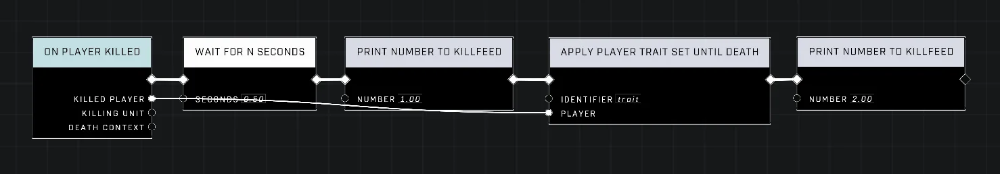
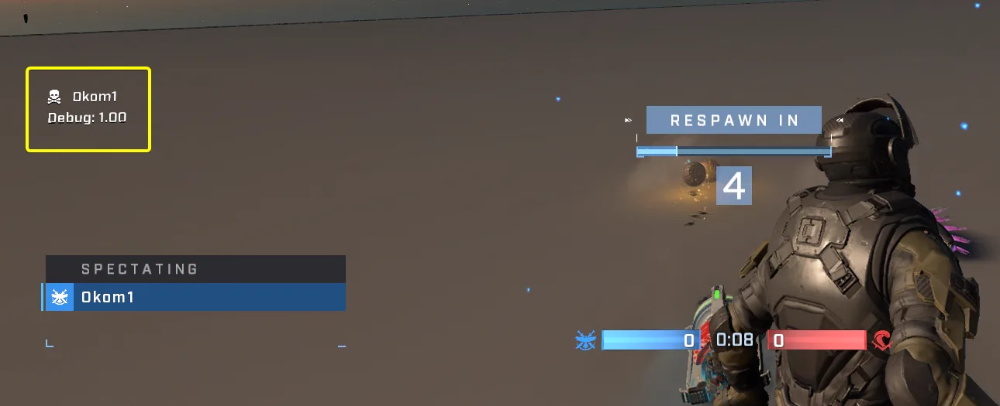

# Apply Player Trait Set Until Death Node on Dead Player Halts Script

<figure><figcaption></figcaption></figure>

When using the [Apply Player Trait Set Until Death](../../../scripting/nodes/traits-player/apply-player-trait-set-until-death.md) node, if the target player is already dead at the time of execution, any subsequent nodes within that script function will fail to execute.

## Node Behavior and Testing Observations

The issue manifests as an immediate halt in the script's logic flow when a deceased player is targeted by this specific node. Test results confirm how the instruction pointer behaves:

* Print nodes placed before `Apply Player Trait Set Until Death` execute successfully.
* Print nodes positioned after `Apply Player Trait Set Until Death` are skipped if the target player is already dead.

<figure><figcaption></figcaption></figure>
<figure><figcaption></figcaption></figure>

### Observed Script Halt

In testing environments, if a script utilizes two separate print nodes (for example, printing `1.00` before and `2.00` after the trait node), only the first number prints when applied to an already deceased player. This effectively terminates the function at that point in the logic chain.

## Impact on Conditional Loops

This behavior can cause significant issues within scripted loops, particularly those used for state monitoring or cleanup.

### Loop Termination Failure

A problematic scenario arises if `Apply Player Trait Set Until Death` is used at the beginning of a loop where player death is intended to serve as an exit condition (e.g., checking "Get Is Dead" later in the same loop). 

If the player dies during the game, once that loop attempts its next iteration:
1. The script hits the `Apply Player Trait Set Until Death` node first.
2. Because the target is dead, execution stops at this node.
3. The subsequent nodes—including any logic meant to detect death and break the loop—are never reached.


Avoid placing `Apply Player Trait Set Until Death` before vital conditional checks within loops that rely on player death status for termination.


***

## Source Data

* Discord thread: [Apply Player Trait Set Until Death Node on Dead Player Halts Script](https://discord.com/channels/220766496635224065/1537030135138746479/1537030135138746479)

#### <mark style="color:green;">Contributors</mark>

Okom
