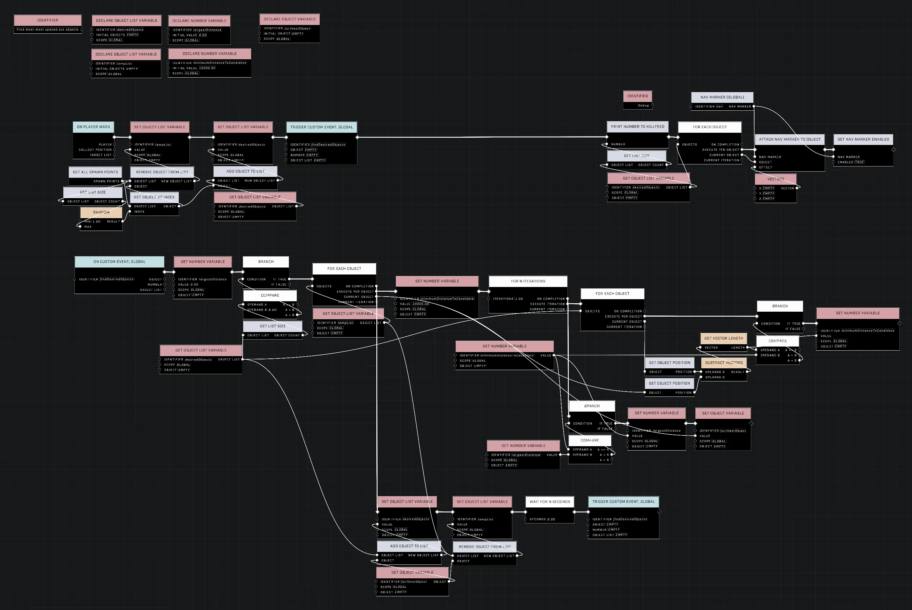
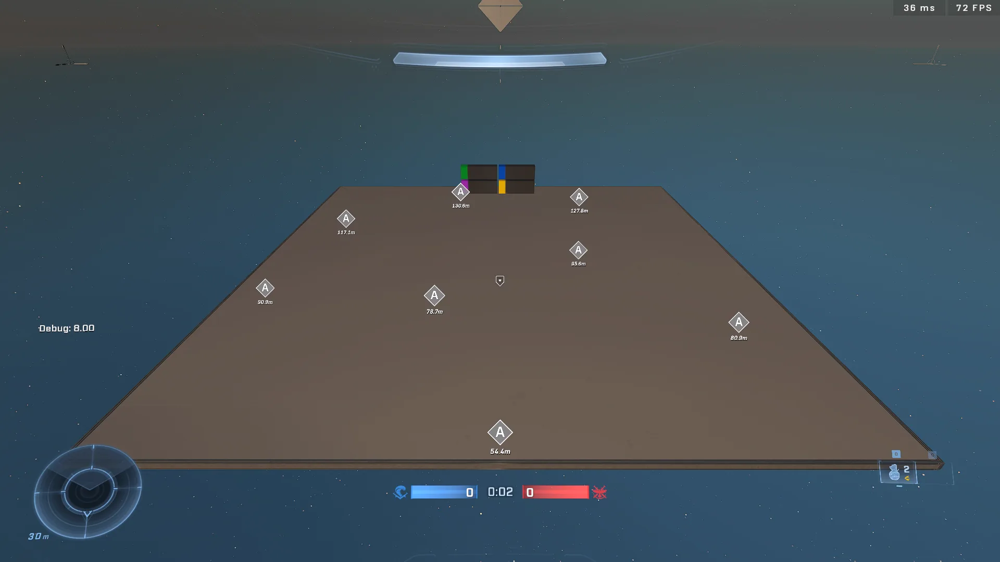

# Find Desired Amount of Furthest Away Objects From Each Other

<figure><figcaption></figcaption></figure>

This method provides a way to select a specific number of objects that are spread out as evenly as possible across an area. By utilizing a variation of "Farthest Point Sampling," the algorithm ensures that every selected object maintains maximum "breathing room" from the rest of the group.

## Spatial Sampling Logic

A common mistake when attempting to find widely spaced objects is searching for the "maximum distance to any single object." This can result in the algorithm selecting a point that is very far from one existing object but touching another. 

To achieve proper distribution, the logic must instead find the point whose **closest neighbor** is as far away as possible from the entire existing set. This is known as Maximizing the Minimum Distance.

### Implementation Workflow

The algorithm builds the set one point at a time through a three-level nested loop structure.

1. **Setup:** Use [Get All Spawn Points](../../../scripting/nodes/objects/get-all-spawn-points.md) (or a similar object retrieval node) to populate an `All Points` list. Use `Create Empty List` to initialize a `Selected Points` list and define a `Target Count`.
2. **Initial Selection:** Use `Get Random Item` from `All Points` to add the first point to the `Selected Points` list, then use `Remove Item` to take it out of `All Points`.
3. **Main Loop:** While the `Count` of `Selected Points` is less than the `Target Count`, perform the following:
  * **Outer Loop:** For each `Candidate` in `All Points`:
  * **Inner-Inner Loop:** For each `Selected Point` in `Selected Points`:
  * Calculate the `Distance` between the `Candidate` and the `Selected Point`.
  * Track the smallest distance found; this is the candidate's "safety buffer."
  * **Comparison:** Once the Inner-Inner Loop finishes, check if this candidate's smallest distance is greater than the current `Max Min Distance`. If it is, update `Max Min Distance` and set this candidate as the `Best Candidate`.
  * **Finalize Round:** After the Outer Loop completes, add the `Best Candidate` to `Selected Points` and remove it from `All Points`.

<figure><figcaption>
The node graph illustrates the nested loop structure required for this sampling logic.
</figcaption></figure>

<figure><figcaption>
This image shows a successful distribution of objects throughout the area.
</figcaption></figure>

<figure><figcaption>
The selected objects are spread across the available space.
</figcaption></figure>

## Variable Management

To ensure the algorithm correctly identifies the most isolated candidate, variables must be reset at different stages of the loop hierarchy.

| Variable | Reset Value | When to Reset | Purpose |
| :--- | :--- | :--- | :--- |
| `Max Min Distance` | `0` | Start of the **Main Loop** | Tracks the largest "safety buffer" found during the current selection round. |
| `Min Distance` | `999999` | Start of the **Outer Loop** | Tracks the distance to the closest neighbor for the current candidate. |


Using a very high number (like `999999`) for the initial `Min Distance` ensures that the first distance calculated for a new candidate will always be smaller than the starting value.


## Performance Considerations

Because this approach utilizes three levels of nested loops, it can be performance-heavy if the total number of objects is high. To mitigate potential frame drops, it is recommended to run this logic once during a loading phase or at the start of a match rather than on a continuous tick.

***

## Source Data

* Discord thread: [Find Desired Amount of Furthest Away Objects From Each Other](https://discord.com/channels/220766496635224065/1508892619319545966/1508892619319545966)

#### <mark style="color:green;">Contributors</mark>

Okom\
Guild Archivist\
swagonflyyyy (Mr. Blackwell)