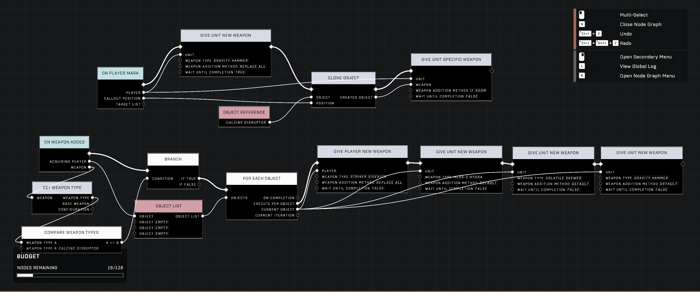

# Granting Four Weapons to Players

<figure><figcaption></figcaption></figure>

By leveraging the Fists weapon's ability to act as a stowable third item, players can bypass standard inventory limits through scripting. This method allows for a maximum of four usable weapons to be carried simultaneously.

## Expanding Weapon Capacity

The core of this technique relies on the Fists weapon, which functions as a third weapon slot that can be stowed away. By using specific scripting logic, this slot can be replaced with standard weaponry to increase the total count.

### Achieving Three Weapons

To expand the inventory to three weapons, the player must use the [Give Player New Weapon](../../../scripting/nodes/inventory/give-player-new-weapon.md) node with the "Swap Secondary" addition. 

The player swaps through their current inventory until the Fists weapon is selected. At this point, the script is triggered to swap the secondary weapon, replacing the Fists with a standard weapon. This results in the player holding three weapons.

### Achieving Four Weapons

To reach the maximum capacity of four weapons, the player must acquire a second set of Fists. Because standard weapon nodes do not behave like pickup events for carriables (such as flags or turrets), this process typically requires manual effort:

* A Fists weapon must be cloned to the ground using the [Clone Object](../../../scripting/nodes/objects/clone-object.md) node.
* The player must manually pick up this second Fists weapon.
* The "Swap Secondary" script is then applied to the new Fists weapon, replacing it with a fourth weapon.

#### Node Considerations

* **[Give Player Specific Weapon](../../../scripting/nodes/inventory/give-player-specific-weapon.md)**: This node is not effective for this method because it replaces one of the two primary inventory slots rather than triggering a pickup event.
* **Default Addition Method**: Using the "Default" weapon addition method does not count as a pickup event; instead, it replaces the current weapon and drops the previous one if the player already holds two weapons.

## Operational Constraints and Behavior

While granting four weapons is possible, it introduces several unique behaviors and limitations within the game environment.

<figure><figcaption>
The screenshot shows a scripting graph used for managing weapon and object interactions.
</figcaption></figure>


Because the process requires the player to pick up cloned Fists weapons from the ground, the method may require manual interaction unless a way to force weapon pickups via scripting is implemented.


### Inventory and UI Behaviors

* **Carriables**: Players holding four weapons may find they are unable to pick up carriables. If a weapon is dropped, the player may regain the ability to pick them up.
* **Ammo Notifications**: The "Out of Ammo" message may only check the secondary weapon. This can lead to inconsistencies in how ammo status is displayed when the primary weapon has been replaced via this method.

***

## Source Data

* Discord thread: [Granting players four weapons](https://discord.com/channels/220766496635224065/1254651856471461939/1254651856471461939)

#### <mark style="color:green;">Contributors</mark>

Okom\
Implied Skill\
AddiCt3d 2CHa0s