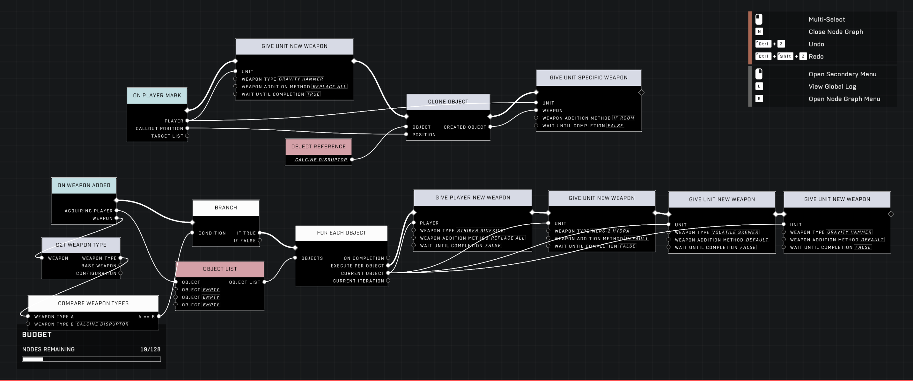
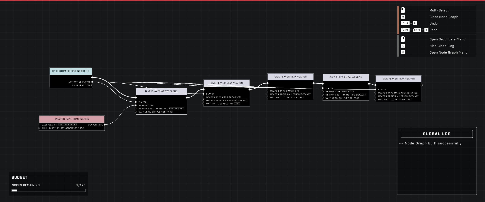
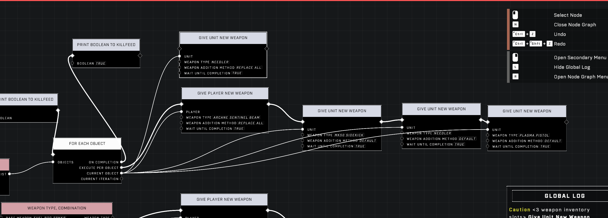

# Granting Four Weapons to Players

<figure><figcaption></figcaption></figure>

By using the stowable Fists weapon and triggering specific animations, players can bypass standard inventory limits to carry four weapons.

## Expanding Weapon Capacity

The core of this technique relies on the Fists weapon, which functions as a third weapon slot that can be stowed away. By using specific scripting logic, this slot can be replaced with standard weaponry to increase the total count.


Certain animations, such as using Custom Equipment or specific weapon pickup animations, allow weapons to be added to an inventory without triggering the function that forces excess weapons to drop.


### Achieving Three Weapons

To expand the inventory to three weapons, the player must use the [Give Player New Weapon](../../../scripting/nodes/inventory/give-player-new-weapon.md) node with the "Swap Secondary" addition. 

The player swaps through their current inventory until the Fists weapon is selected. At this point, the script is triggered to swap the secondary weapon, replacing the Fists with a standard weapon. This results in the player holding three weapons.

### Achieving Four Weapons

To reach the maximum capacity of four weapons, players can use manual methods or scripted patterns that trigger the necessary animations to prevent excess weapons from dropping.

#### Manual Method

If not using animation-triggering patterns, the process typically requires manual effort:

* A Fists weapon must be cloned to the ground using the [Clone Object](../../../scripting/nodes/objects/clone-object.md) node.
* The player must manually pick up this second Fists weapon.
* The "Swap Secondary" script is then applied to the new Fists weapon, replacing it with a fourth weapon.

#### Scripted Patterns

* **If Room Method**: Using the "If Room" weapon addition method appears to trigger the required animation.
* **Custom Equipment Method**: Using Custom Equipment can put the player in the correct animation to trigger the effect.
* A [working prefab example](https://www.halowaypoint.com/halo-infinite/ugc/prefabs/533259af-187a-4fd4-99d7-e9afe9b54950) is available on Halo Waypoint.

 <figure><figcaption>
The screenshot shows a pattern that successfully uses the If Room weapon addition method.
</figcaption></figure>

 <figure><figcaption>
The screenshot shows a pattern that utilizes Custom Equipment to trigger the required animation.
</figcaption></figure>

#### Node Considerations

* **[Give Player Specific Weapon](../../../scripting/nodes/inventory/give-player-specific-weapon.md)**: This node is not effective for this method because it replaces one of the two primary inventory slots rather than triggering a pickup event.
* **Replace All Timing**: The "Replace All" addition may fail with certain weapons due to `Wait Until Completion` timing issues. A workaround is to use [Delete Object](../../../scripting/nodes/objects/delete-object.md) on the player's secondary weapon, followed by a `Wait` node, then use [Give Unit Specific Weapon](../../../scripting/nodes/inventory/give-unit-specific-weapon.md) to fill the emptied slot.
* **Give Player vs. Give Unit**: There are observed differences where `Give Player Weapon` works for the first of four weapons while `Give Unit Weapon` does not.
* **Default Addition Method**: Using the "Default" weapon addition method does not count as a pickup event; instead, it replaces the current weapon and drops the previous one if the player already holds two weapons.

 <figure><figcaption>
The screenshot shows differences in behavior when using Give Player Weapon versus Give Unit Weapon.
</figcaption></figure>

## Operational Constraints and Behavior

While granting four weapons is possible, it introduces several unique behaviors and limitations within the game environment.

<figure><figcaption>
The screenshot shows a scripting graph used for managing weapon and object interactions.
</figcaption></figure>


Because the process requires the player to pick up cloned Fists weapons from the ground, the method may require manual interaction unless a way to force weapon pickups via scripting is implemented.


### Inventory and UI Behaviors

* **Carriables**: Players holding four weapons may find they are unable to pick up carriables. If a weapon is dropped, the player may regain the ability to pick them up.
* **Ammo Notifications**: The "Out of Ammo" message may only check the secondary weapon. This can lead to inconsistencies in how ammo status is displayed when the primary weapon has been replaced via this method.

***

## Source Data

* Discord thread: [Granting players four weapons](https://discord.com/channels/220766496635224065/1254651856471461939/1254651856471461939)
* Discord thread: [Granting Players 4 Weapons](https://discord.com/channels/220766496635224065/1432967266630238208/1432967266630238208)

#### <mark style="color:green;">Contributors</mark>

Okom\
Implied Skill\
AddiCt3d 2CHa0s\
Toast