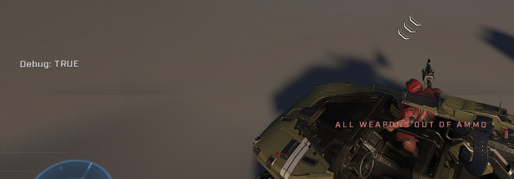

# Gravity Hammer Swing Detection

<figure><figcaption></figcaption></figure>

Because Forge lacks an `On Weapon Fired` node and cannot directly track the charge amount of energy weapons, detecting a Gravity Hammer swing requires a combination of rotation monitoring and ammo manipulation.

## Detection and Simulation Logic

<figure><figcaption>
The implementation can be used to track hammer swings during active gameplay.
</figcaption></figure>

### Rotation-Based Swing Identification

The system monitors the rotation of the player's equipped weapon every tick. A swing is identified when the X value of the weapon's rotation exceeds 120. This threshold is effective because the hammer swing causes a more drastic change in weapon rotation than other available poses.


The Gravity Hammer swing detection in action, as well as a showcase of the scripting


### Ammo Depletion and Melee Validation

To track whether a swing results in a hit while maintaining the hammer's intended ammo capacity, the following logic is applied:

* The player's secondary weapon is dropped.
* The hammer's ammo is emptied and then refilled to 10%, which is the method used to reduce the ammo of a single weapon.
* The secondary weapon is returned to the player.
* If a hit occurs, the [On Weapon No Ammo](../../../scripting/nodes/events-inventory/on-weapon-no-ammo.md) event gets triggered. A number variable is then used to restore the desired amount of ammo and decrement the value for the next swing.
* If the number variable is not modified within 1 second, the swing is treated as a dummy melee hit (pressing melee button instead of fire button), and the charge is restored.

## Customization and Constraints

### Modifying Swing Capacity

Users can artificially increase the number of available swings by adjusting the amount by which the number variable is decremented. For instance, changing the decrement from -10 to -5 allows for a total of 20 swings instead of the standard 10.


An "Out of Ammo" message may briefly appear on the player's screen during the ammo replenishment process.


### Known Limitations

* **Vehicle Interaction:** Swinging the hammer while moving forward in a vehicle can cause the detection to break.
* **Ammo Pickup Issues:** Picking up ammo from a dropped weapon of the same type can cause issues, as the system cannot reliably detect the amount of ammo acquired to update the `hammerAmmoRemaining` variable.

***

## Source Data

* Discord thread: [Gravity Hammer Swing Detection](https://discord.com/channels/220766496635224065/1452293659574669322/1452293659574669322)

#### <mark style="color:green;">Contributors</mark>

Okom
