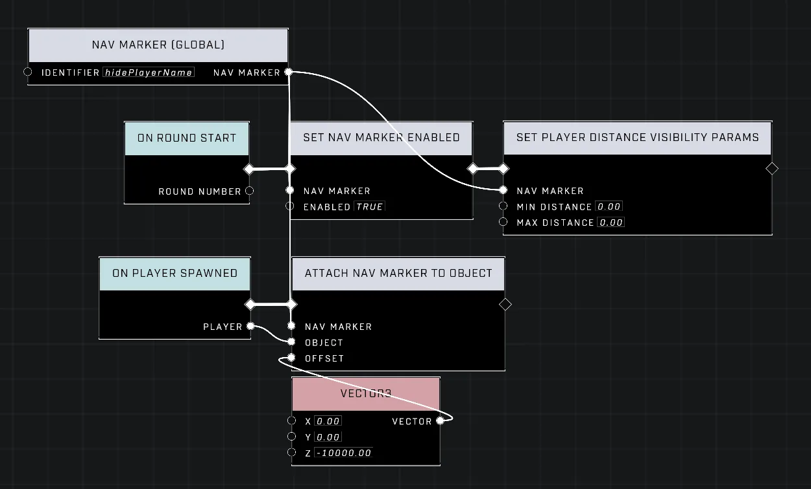
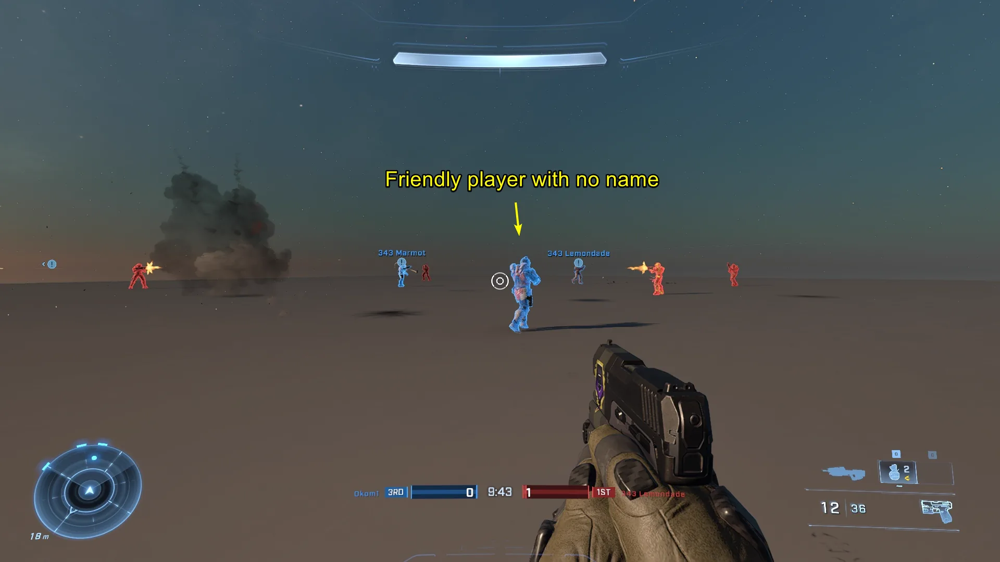
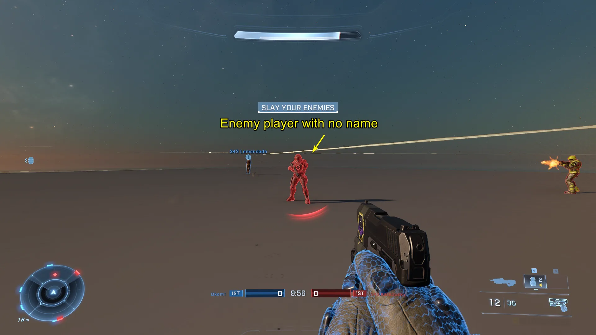
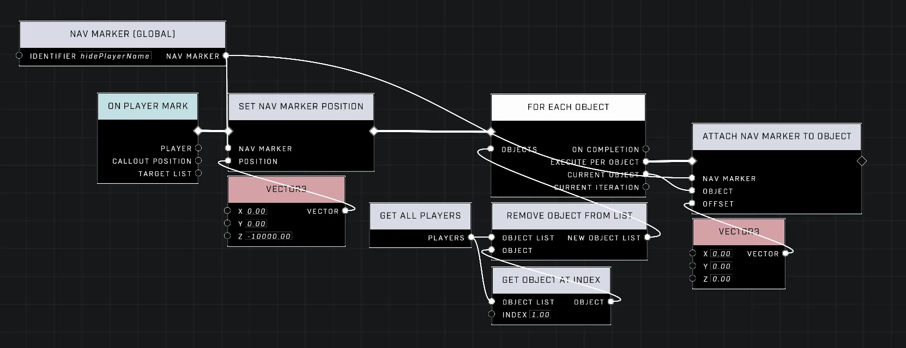
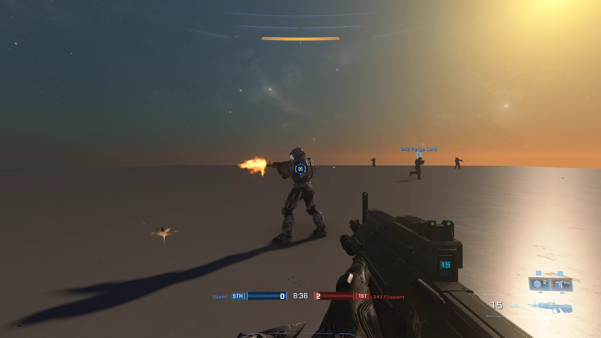
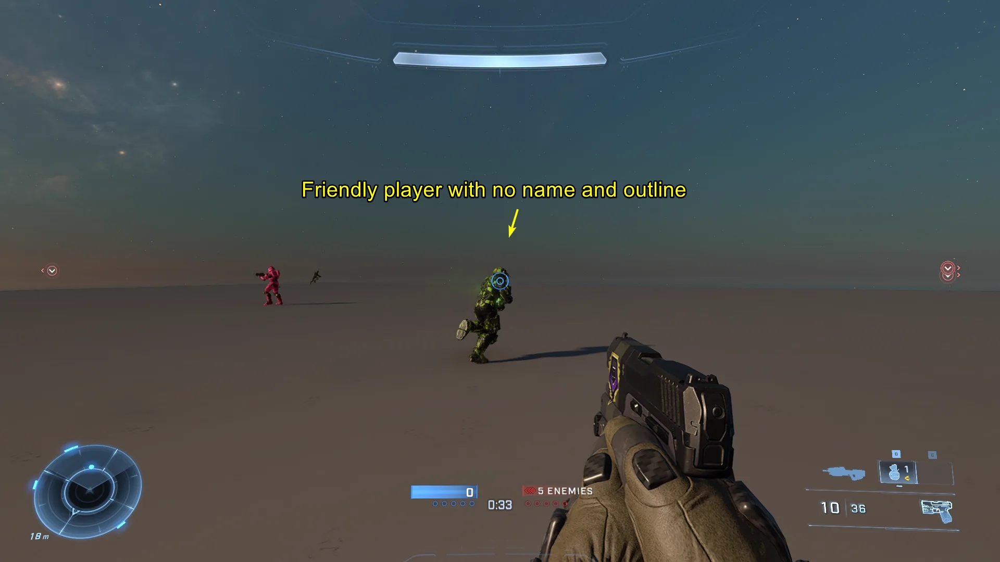

# Hiding Player Name Visibility

<figure><figcaption></figcaption></figure>

While player names are typically fixed in Halo Infinite, scripting provides an unconventional way to remove a specific player's name globally for all players.

## Hiding a Player's Name

To remove a player's name, a Nav Marker must be attached to that player using the [Attach Nav Marker To Object](../../../scripting/nodes/ui-nav-markers/attach-nav-marker-to-object.md) node. In custom games, this action inherently overrides the player's name.

### Hiding the Nav Marker

Because an attached Nav Marker remains visible and follows the player, its visibility must be adjusted to ensure it does not appear. This is achieved by using the [Set Player Distance Visibility Params](../../../scripting/nodes/ui-nav-markers/set-player-distance-visibility-params.md) node on the [Nav Marker](../../../scripting/nodes/ui-nav-markers/nav-marker.md) with the following settings:

* Min Distance: 0.00
* Max Distance: 0.00

This configuration clamps the visible viewing distance to 0, effectively making the Nav Marker hidden at all times. This technique works in both team-based modes and free-for-all modes where FFA Allegiance is utilized to create allied teammates.


To prevent player marks from hitting the invisible Nav Marker—which can occur when marking or for the player being marked—adjust the Nav Marker's offset to `Z: -10,000`. This moves the marker out of the way while still allowing it to override the player's name.


<figure><figcaption>
The required scripting nodes including the offset adjustment.
</figcaption></figure>
<figure><figcaption>
A friendly player's name is hidden.
</figcaption></figure>
<figure><figcaption>
An enemy player's name is hidden.
</figcaption></figure>


The effect of the player name disappearing cannot be previewed in Forge mode, and only works in a custom game.


## Restoring Player Name Visibility

To show a player's name again after hiding it with the `Nav Marker` attachment method, the `Nav Marker` must be detached from the player. The only ways to detach a `Nav Marker` from an object are to have the object despawn or to adjust the position of the `Nav Marker`.

Since we don't want to kill the player, we'll need to adjust the `Nav Marker`'s position with the [Set Nav Marker Position](../../../scripting/nodes/ui-nav-markers/set-nav-marker-position.md) node. The inconvenient feature here is if the same `Nav Marker` had been attached to multiple players, it will also detach from multiple players when the `Nav Marker`'s position is updated. To practically remove the `Nav Marker` from just one desired player, it must first be detached from all players, and then reattached to all players other than the desired player.

<figure><figcaption>
An example of detaching a Nav Marker from an object.
</figcaption></figure>
<figure><figcaption>
A background player has their name successfully returned.
</figcaption></figure>

## Removing Player Outlines

Optionally you can also remove the player outlines in the mode settings of the loaded mode via `HUD → Friendly Player Outlines`: Off, and `HUD → Enemy Player outlines`: Off to achieve a uniquely clean player UI without adjustments to players' local HUD settings.

<figure><figcaption>
The mode settings used to disable player outlines.
</figcaption></figure>

***

## Source Data

* Discord thread: [Hiding Player Name Visibility](https://discord.com/channels/220766496635224065/1541139305098125343/1541139305098125343)

#### <mark style="color:green;">Contributors</mark>

Okom