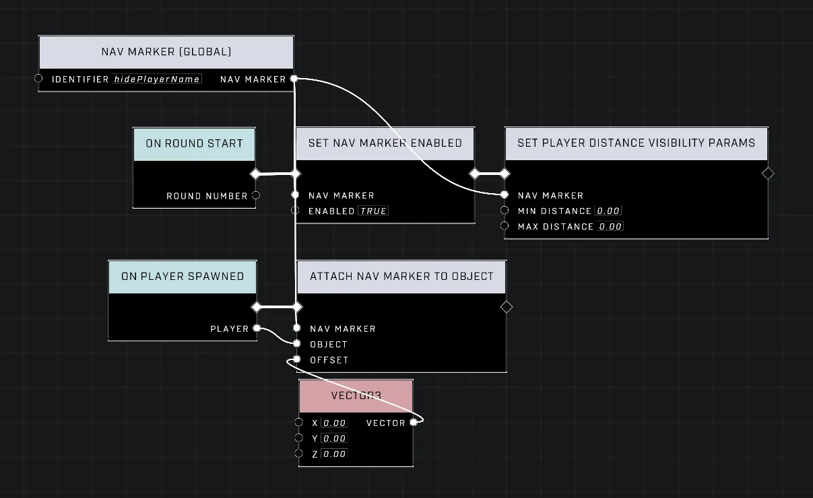

# Hiding Player Name Visibility

<figure><figcaption></figcaption></figure>

While player names are typically fixed in Halo Infinite, scripting provides an unconventional way to remove a specific player's name globally for all players.

## Hiding a Player's Name

To remove a player's name, a Nav Marker must be attached to that player using the [Attach Nav Marker To Object](../../../scripting/nodes/ui-nav-markers/attach-nav-marker-to-object.md) node. In custom games, this action inherently overrides the player's name.

### Hiding the Nav Marker

Because an attached Nav Marker remains visible and follows the player, its visibility must be adjusted to ensure it does not appear. This is achieved by using the [Set Player Distance Visibility Params](../../../scripting/nodes/ui-nav-markers/set-player-distance-visibility-params.md) node on the Nav Marker with the following settings:

* Min Distance: 0.00
* Max Distance: 0.00

This configuration clamps the visible viewing distance to 0, effectively making the Nav Marker hidden at all times. This technique works in both team-based modes and free-for-all modes where FFA Allegiance is utilized to create allied teammates.

<figure><figcaption>
The required scripting nodes.
</figcaption></figure>
<figure><figcaption>
Friendly name hidden.
</figcaption></figure>
<figure><figcaption>
Enemy name hidden.
</figcaption></figure>


The effect of disappearing player names cannot be previewed in Forge mode and only functions within a custom game.


## Restoring Player Name Visibility

To show a player's name again after using the Nav Marker attachment method, the Nav Marker must be detached from the player. A Nav Marker can be detached by having the object despawn or by adjusting the marker's position using the [Set Nav Marker Position](../../../scripting/nodes/ui-nav-markers/set-nav-marker-position.md) node.

#### Implementation Constraints

If a single Nav Marker is attached to multiple players, updating its position will cause it to detach from all of those players simultaneously. To selectively remove the Nav Marker (and thus the name) from only one specific player, the marker must first be detached from all players and then reattached to everyone except the intended target.

<figure><figcaption>
An example of detaching a Nav Marker from an object.
</figcaption></figure>
<figure><figcaption>
A background player with their name successfully returned.
</figcaption></figure>

## Removing Player Outlines

As an additional option, player outlines can be removed via the mode settings of the loaded mode using the following configurations in order to achieve a uniquely clean player UI, without any adjustments to players' local HUD settings:

* `HUD → Friendly Player Outlines`: Off
* `HUD → Enemy Player Outlines`: Off

<figure><figcaption>
The mode settings used to disable player outlines.
</figcaption></figure>

***

## Source Data

* Discord thread: [Hiding Player Name Visibility](https://discord.com/channels/220766496635224065/1541139305098125343/1541139305098125343)

#### <mark style="color:green;">Contributors</mark>

Okom
