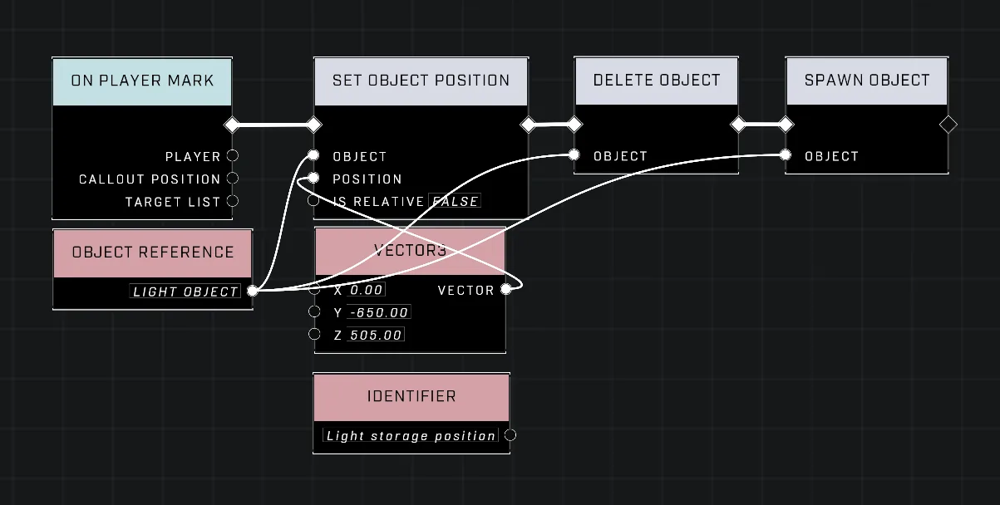

# Light Rendering Distance Limits and Disappearing

<figure><figcaption></figcaption></figure>

Light objects are subject to engine-level rendering distance limits. While these limits optimize performance, they can cause issues in scripted scenarios—such as flashlights that follow the player—causing lights to stop rendering or appear in incorrect locations.

## Rendering Distance Thresholds

### The 650-Unit Limit

Light objects will stop working if they are more than 650 units away from the player. This distance limit specifically affects the light-emitting portion of the object. 

When a script adjusts the position of a light object—such as a flashlight loop designed to keep a light at the player's position—the following behavior may occur:
* The physical object part of the light will follow the player via the script.
* If the light-emitting portion is currently outside the 650-unit radius, it will not render.
* Consequently, even if the light object is moved directly to the player's position by a script, the light will remain at its previous location until the player re-enters the 650-unit radius of the original emission point.


The video demonstrates a light object failing to render its light-emitting portion despite the object's position being adjusted.



If a light's position is moved to a location more than 650 units from the player, the light will not render again until the player moves back within that 650-unit radius.


## Mitigation

To prevent lights from becoming non-functional when they are moved across large distances, the light object can be deleted and respawned right after it has been reset back to the storage position. Using the node sequence [Delete Object](../../../scripting/nodes/objects/delete-object.md) → [Spawn Object](../../../scripting/nodes/objects/spawn-object.md) at any time forces a full clientside update that resets the rendering cut-off distance. This ensures the light-emitting portion renders correctly even if the object was previously more than 650 units away from the player.

<figure><figcaption></figcaption></figure>

***

## Source Data

* Discord thread: [Light Rendering Distance Limits and Disappearing](https://discord.com/channels/220766496635224065/1541501331460587661/1541501331460587661)

#### <mark style="color:green;">Contributors</mark>

Okom\
Mr Multibit\
MadmanEpic
