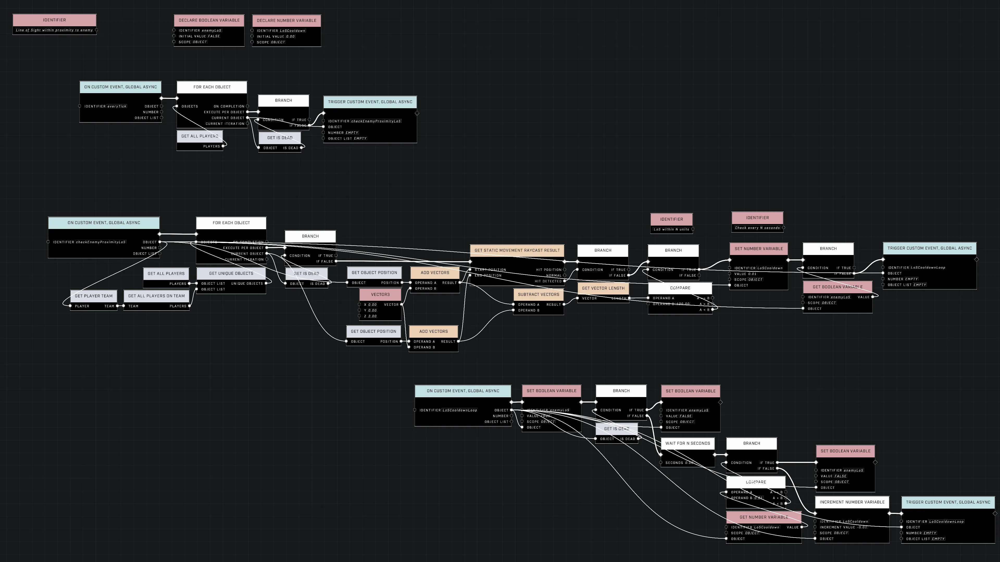

# Line of Sight (LoS) Within Proximity to Enemy

<figure><figcaption></figcaption></figure>

This technique provides a way to determine if a player has a clear line of sight to a target enemy within a specific range. By combining raycasting with distance thresholds and a cooldown timer, developers can create vision systems that include customizable decay times.

## Implementation Logic

The core of this system relies on verifying that no static obstructions exist between the player and the target while ensuring they are within a set distance.

### Raycasting and Distance Verification

To perform the check, use a `Static Movement Raycast` from the player's position to the position of the target enemy. Because the raycast is intended to detect static obstructions between the two players, a result where `Hit Detected` is `False` indicates that the line of sight is clear.

Once a clear line of sight is confirmed, the distance between the player and the target is compared against a desired range. This allows the check to only pass if the enemy is both visible and close enough to the player.

## Cooldown and Decay Management

To prevent the line of sight boolean from flickering instantly when vision is interrupted, a cooldown loop can be implemented. This loop uses an adjustable timer to create a "decay time" for the vision state.

* **Low Decay:** Setting the timer to a very low value, such as 0.10 s, allows the system to function without any noticeable delay.
* **High Decay:** Setting a higher timer, such as 5 s, requires the line of sight to remain broken for the full duration before the boolean is turned off.

## Visualization and Debugging

Visualizing the status of the line of sight boolean is useful for testing and ensuring the logic behaves as expected in real-time.

<figure><figcaption>
The script demonstrates the implementation of line of sight and proximity checks.
</figcaption></figure>


This video demonstrates the vision prompt appearing and disappearing based on the line of sight status.



For a cleaner UI, avoid using branches to toggle between different messages (such as showing "1" or "0"). Instead, feed the boolean variable directly into the `show widget` parameter of a single [Set Prompt WIdget For Player](../../../scripting/nodes/ui/set-prompt-widget-for-player.md) node. This allows a "Vision" prompt to appear and disappear naturally based on the vision state.


For further testing of these mechanics, a demo map is available on [Halo Waypoint](https://www.halowaypoint.com/halo-infinite/ugc/maps/057958d3-988c-43c9-a849-0becf2838164).

***

## Source Data

* Discord thread: [Line of Sight (LoS) Within Proximity to Enemy](https://discord.com/channels/220766496635224065/1508533080988713210/1508533080988713210)

#### <mark style="color:green;">Contributors</mark>

Okom\
swagonflyyyy (Mr. Blackwell)