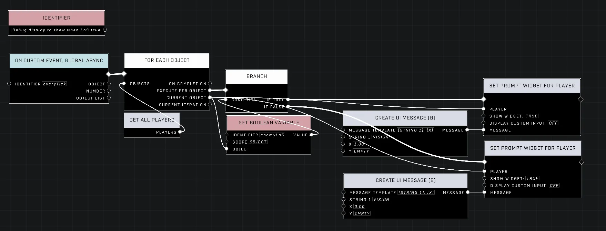

# Line of Sight (LoS) Within Proximity to Enemy

<figure><figcaption></figcaption></figure>

This technique allows for detecting when a player has visual contact with an enemy within a defined radius. By combining raycasting with distance checks, developers can trigger specific UI elements or logic when an enemy is both seen and close.

## Implementing Detection Logic

The detection process involves verifying two simultaneous conditions: that the path between the player and the target is clear and that the target is within a designated range.

### Raycasting and Distance Checks

To verify line of sight, a `Static Movement Raycast` is performed from the position of the player to the position of the target enemy. 

* **Obstruction Check**: When the raycast is performed specifically between the two players, a `Hit Detected: False` result indicates that no static obstructions are blocking the path. 
* **Proximity Check**: If the line of sight is clear, the distance between the player and the enemy is compared against a desired range. The check passes only if the enemy is within this specified proximity.

#### Cooldown Implementation

To prevent the detection boolean from flickering when line of sight is momentarily broken, a cooldown loop can be implemented. This loop uses an adjustable timer to create a "decay time" for the boolean status.

* A low timer (e.g., 0.10 s) functions without significant delay.
* A higher timer (e.g., 5 s) requires the line of sight to be broken for several seconds before the boolean is turned off.

## User Interface and Debugging

Visualizing the state of the line of sight boolean can assist in tuning the detection parameters and ensuring the proximity thresholds behave as intended.

<figure><figcaption>
This script displays the real-time status of the line of sight boolean for each player.
</figcaption></figure>

The detection can be used to trigger UI elements, such as a vision prompt, when the conditions are met.

<figure><figcaption>
The vision prompt appears and disappears based on the proximity and visibility of the enemy.
</figcaption></figure>


A demonstration of the vision prompt functioning when an enemy enters the proximity and line of sight range.


You can test these mechanics using the [Player LoS proximity demo](https://www.halowaypoint.com/halo-infinite/ugc/maps/057958d3-988c-43c9-a849-0becf2838164).


To optimize the UI logic, the boolean variable can be fed directly into the `show widget` parameter of a [Set Prompt WIdget For Player](../../../scripting/nodes/ui/set-prompt-widget-for-player.md) node. This is more efficient than using a [Branch](../../../scripting/nodes/logic/branch.md) to toggle between two separate nodes for different message states.


***

## Source Data

* Discord thread: [Line of Sight (LoS) Within Proximity to Enemy](https://discord.com/channels/220766496635224065/1508533080988713210/1508533080988713210)

#### <mark style="color:green;">Contributors</mark>

Okom\
swagonflyyyy (Mr. Blackwell)