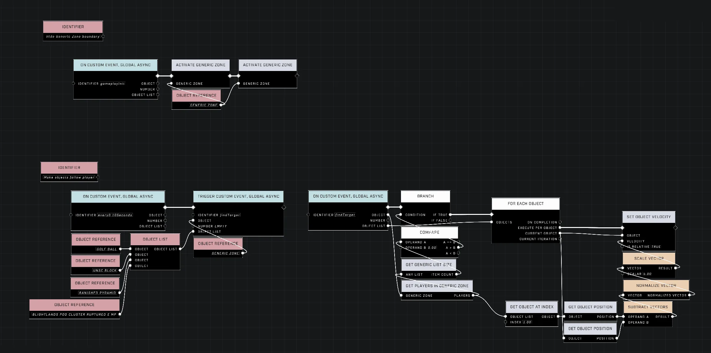

# Make Object Follow Player While in Zone

<figure><figcaption></figcaption></figure>

This method allows objects, such as a Fusion Coil, to track and move toward players who enter a designated Generic Zone. By applying a constant velocity based on the direction between the object and the player, the object can continuously chase the player as long as they remain within the area.

## Implementing the Chase Logic

### Calculating Velocity and Direction

To move an object toward a player, a constant velocity must be applied in the direction of that player. This can be achieved by retrieving the position of both the object and the player and feeding them into the [Subtract Vectors](../../../scripting/nodes/math/subtract-vectors.md) node. The resulting output vector provides the direction required for the object's velocity.


Adjusting the [Scale Vector](../../../scripting/nodes/math/scale-vector.md) value determines how fast the objects move towards the player.


### Maintaining a Periodic Loop

For the object to constantly approach the player, the velocity must be applied repeatedly through a continuous loop. One method for creating this loop within an area is to use a "heartbeat" script.

This can be implemented using the `On Custom Event, Global, Anying` node with an "[Every N Seconds](../../../scripting/nodes/events-custom/every-n-seconds.md)" setting (such as 0.1 seconds) to periodically check the status of the zone. To track players, you can add players to an [Object List](../../../scripting/nodes/variables-basic/object-list.md) when they enter a Generic Zone and remove them when they exit. The script can then use [Get List Size](../../../scripting/nodes/objects/get-list-size.md) and a [Branch](../../../scripting/nodes/logic/branch.md) node to check if any players are currently in the list. If the list size is greater than zero, the script can run the chase logic for each player in that list using a [For Each Object](../../../scripting/nodes/logic/for-each-object.md) node.

<figure><figcaption>
The script layout shows how to detect players in a zone and move objects toward them.
</figcaption></figure>


The demonstration shows an object successfully tracking a player's movement within a designated area.


## Behavior and Limitations

### Movement and Targeting

There are several behavioral nuances to consider when implementing this system:

* **Origin Point:** Because a player's position originates from their feet, moving objects will track the player's feet.
* **Airborne Tracking:** Objects will follow a player even if they are airborne. If this behavior is undesired, a condition can be implemented using the [Get Is Airborne](../../../scripting/nodes/units/get-is-airborne.md) node.
* **Targeting Limitations:** The simple implementation described here targets the first player detected in the Generic Zone's player list. A more advanced system would require an ordered list of distances to ensure the object tracks the closest player in a multi-player environment.

### Physical Risks

When using certain objects like a Fusion Coil, there is a risk of the object blowing up if it drags against the floor or hits walls while attempting to reach the player.

***

## Source Data

* Discord thread: [Make Object Follow Player While in Zone](https://discord.com/channels/220766496635224065/1505172135445008424/1505172135445008424)

#### <mark style="color:green;">Contributors</mark>

What's The Password?\
Okom\
AddiCt3d 2CHa0s 🎮 💻