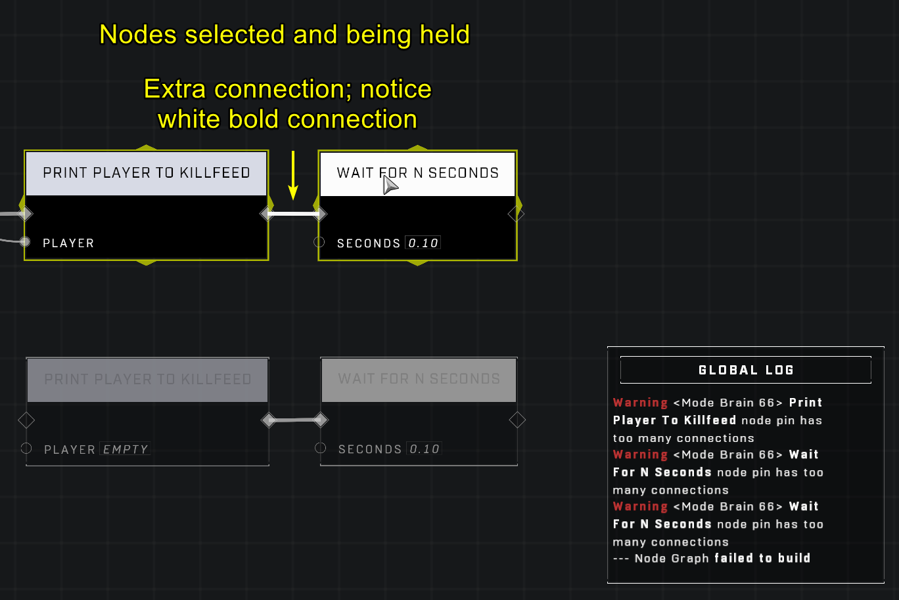
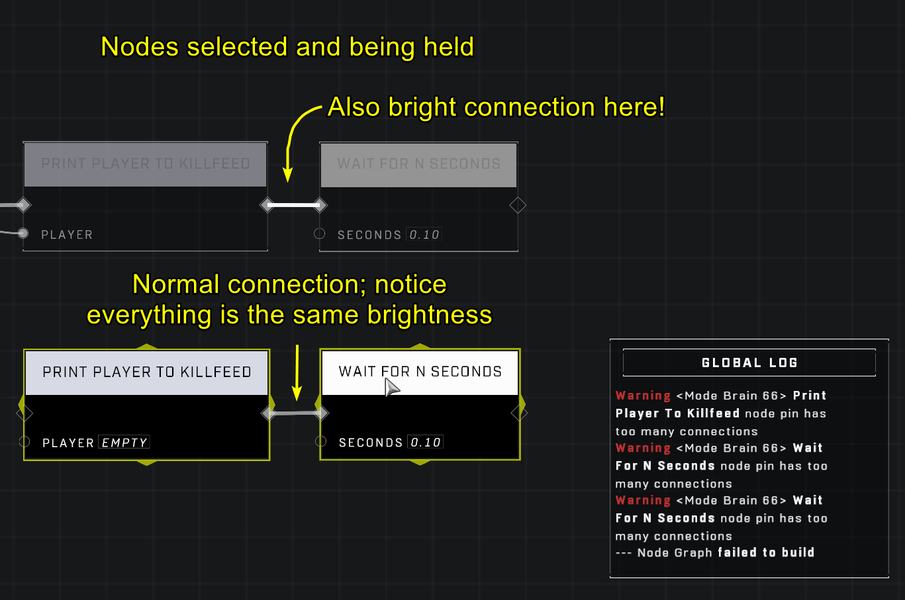

# Node Pin Has Too Many Connections Error

<figure><figcaption></figcaption></figure>

The "Node Pin Has Too Many Connections" error is a frontend issue that occurs when a duplicate connection is established on a node pin. This most commonly happens when a lag spike occurs at the exact moment a user is attempting to connect a pin, resulting in the system registering multiple connections where only one was intended. Because a double connection is illegal, the node graph fails to build.

## Identifying the Error

This error is not inherently tied to the logic of a script, but rather to the stability of the connection process itself. Even if the scripting logic is valid, the presence of a duplicate connection will trigger the error in the global log.

<figure><figcaption>
The global log displays warnings when a node pin contains too many connections.
</figcaption></figure>

### Detection via Visual Cues

If a brain is experiencing this error, you can identify the faulty connection using visual feedback in the editor.

* Select all nodes within the affected brain.
* Hold the selection.
* Look for any connection that appears brighter than the others.

A connection that is brighter than the rest indicates a duplicate connection.

<figure><figcaption>
A duplicate connection appears brighter than standard connections when nodes are selected and held.
</figcaption></figure>


A video demonstrating how a lag spike can cause an accidental extra connection.


## Resolving the Error

There are several methods to resolve this error, ranging from simple connection resets to structural changes in the script.

### Connection Reset

The most direct way to fix the issue is to remove the duplicate connection:

1. Locate the duplicate connection using the connection brightness method described above.
2. Disconnect the faulty connection.
3. Reconnect the connection.

If simply disconnecting and reconnecting the pin does not work, you may need to delete the problematic nodes entirely and then recreate them and their connections.

### Scripting Workarounds

In some cases, especially when working with very complex logic or highly populated brains, the error may be more persistent.

* **Split Logic with Custom Events:** If a single connection tree is highly complex, it may be prone to lag spikes during connection. You can mitigate this by splitting the logic into two or more groups using a [Trigger Custom Event](../../../scripting/nodes/events-custom/trigger-custom-event.md) node in the middle.
* **Reload the Game:** For certain random errors, reloading the game may help clear the state.


Brains that are very full or contain highly complex connection trees may be more prone to these connection errors.


***

## Source Data

* Discord thread: [Node Pin Has Too Many Connections](https://discord.com/channels/220766496635224065/1404459901178220575/1404459901178220575)

#### <mark style="color:green;">Contributors</mark>

Okom\
Jordan9232\
Riveringston\
Terham
