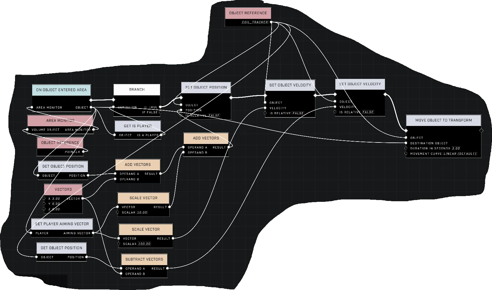

# Make Object Follow Player While in Zone

<figure><figcaption></figcaption></figure>

This technique allows objects to track and pursue players who enter a designated area. By applying a constant velocity calculated from the distance between the object and the player, the object can move smoothly to intercept the target.

## Calculating Pursuit Velocity

To create movement toward a target, you can subtract the player's position from the object's position using [Subtract Vectors](../../../../scripting/nodes/math/subtract-vectors.md). The resulting vector represents the direction in which the object's velocity should be applied.

To control the speed at which the object approaches the player, use a [Scale Vector](../../../../scripting/nodes/math/scale-vector.md) node to adjust the magnitude of the direction vector.

<figure><figcaption>
An initial attempt shows the object attempting to track a player within a zone.
</figcaption></figure>


This video demonstrates the behavior of an object being moved toward a player.


## Maintaining the Pursuit Loop

Because velocity must be applied continuously to maintain tracking, a repeating "heart beat" loop is required. This can be implemented using the [Every N Seconds](../../../../scripting/nodes/events-custom/every-n-seconds.md) node found in `Events Custom`.

To ensure the loop only runs when players are within the target area, you can use one of the following detection methods:

* **[Object List](../../../../scripting/nodes/variables-basic/object-list.md) Method:** When a player enters the zone, add them to an `Object List`. When they exit, remove them from the list. Use [Get List Size](../../../../scripting/nodes/objects/get-list-size.md) and a [Branch](../../../../scripting/nodes/logic/branch.md) node to check if the list contains more than 0 players before executing the pursuit logic.
* **[Boolean](../../../../scripting/nodes/variables-basic/boolean.md) Method:** Set an `Object Scoped Boolean Variable` to true when a player enters the area and false when they exit. The loop can then check this variable before running the chase script.

<figure><figcaption>
The completed script uses a loop to detect players in a zone and move objects toward them.
</figcaption></figure>


The demo shows an object successfully following a player who remains inside the zone.


## Implementation Considerations


Objects will follow the player's feet, as that is where the player's position originates. Additionally, objects may follow players while they are airborne unless specific conditions are added.


When using certain objects, such as a Fusion Coil, be aware that they may blow up if they drag against floors or collide with walls while pursuing a player. To prevent objects from chasing players while they are in the air, you can implement a condition using the [Get Is Airborne](../../../../scripting/nodes/units/get-is-airborne.md) node.

### Multi-player Support

The simple approach provided in this implementation only looks for the first player detected in the zone's player list. To support multiple players more effectively, a system would need to be developed to calculate the distance to each player and determine which one is closest to the object.

***

## Source Data

* Discord thread: [Make Object Follow Player While in Zone](https://discord.com/channels/220766496635224065/1505172135445008424/1505172135445008424)

#### <mark style="color:green;">Contributors</mark>

What's The Password?\
Okom\
AddiCt3d 2CHa0s