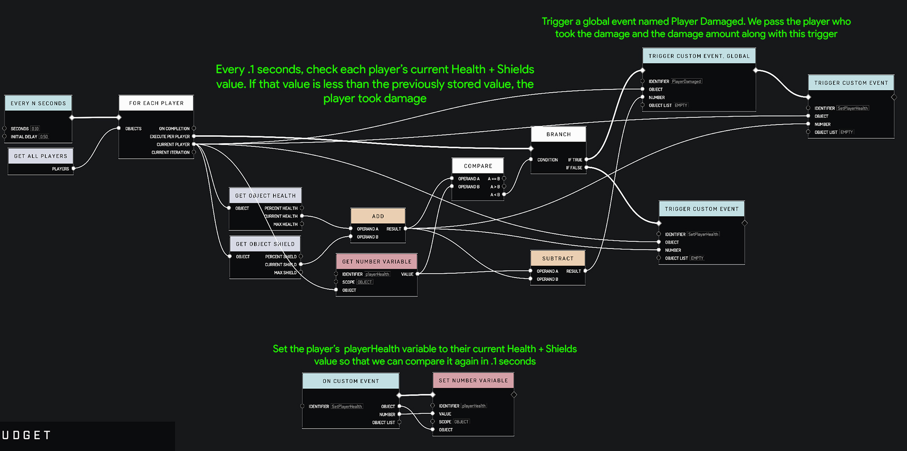

# Polling Player Health

Because we do not have event listeners for detecting damage events in relation to players, we have to poll their health values and monitor them for changes if we want to produce outputs whenever a player is damaged.\
\
The script below provides an example for how to do this.

* Store player health+shields in a variable scoped to each player.
* Compare this value to each player's current health+shields every tick.
* If the current value is lower than the stored value, output a damage event in relation to the damaged player.

<figure><figcaption></figcaption></figure>

 

<figure><figcaption></figcaption></figure>

**Contributors**\
Captain Punch\
RellimJoe
