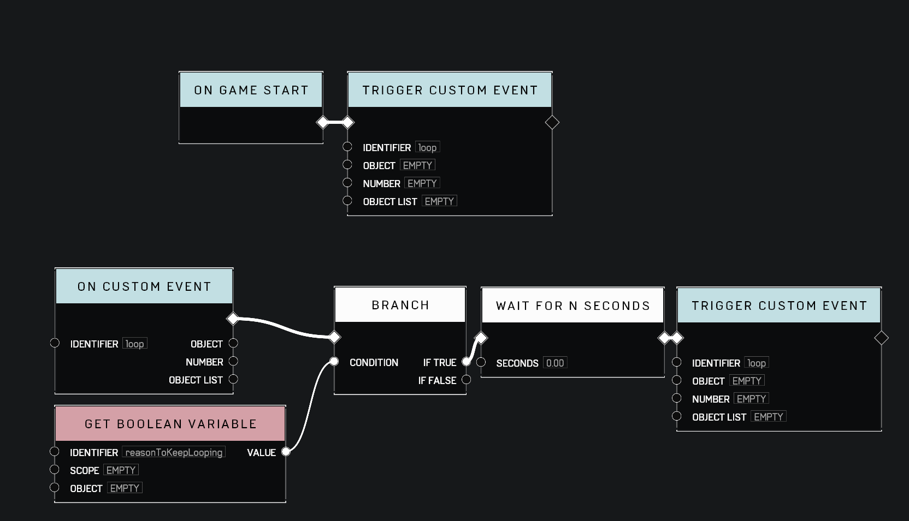

# Recursive Functions

### Understanding Recursive Functions

A recursive function is one that triggers itself at the end of its process. This programming approach is beneficial for scenarios involving repetitive actions or conditions where a function needs to continuously monitor or adjust based on specific criteria.

<figure><figcaption>
The most basic example of a Recursive Loop. Depending on your use case, the Wait may need to be before or after the Branch and there may need to be multiple Branches.
</figcaption></figure>

### Example Use Case

A practical example would be the use of a recursive function in a game mechanic similar to "king of the hill." In this scenario, a player needs to be within an area monitor to score points or be given a special ability. By calling a Custom Event that triggers itself at the end of the circuit, the script can constantly check for players within the area monitor and adjust their points total accordingly.

### Cautionary Notes

1. **Delay Requirement:** Recursive triggers must include some type of delay. Failing to do so can lead to triggers occurring so rapidly that the server crashes. It is recommended to always incorporate a WAIT N SECONDS node within the logic chain with a small delay. A wait of 0 seconds will work and cause the loop to iterate once per tick.
2. **Resource Intensive Logic:** If the logic chain within the recursive function involves resource-intensive processes such as vector math, extensive logic checks, or significant data handling, it can degrade map performance and potentially lead to a server crash.

### Best Practices

Always test the recursive function in both Forge and custom games. Additionally, test it with a larger game lobby of players before publishing the map for public play.

**Contributors**\
Captain Punch\
MathAd\
Yolomcswag
