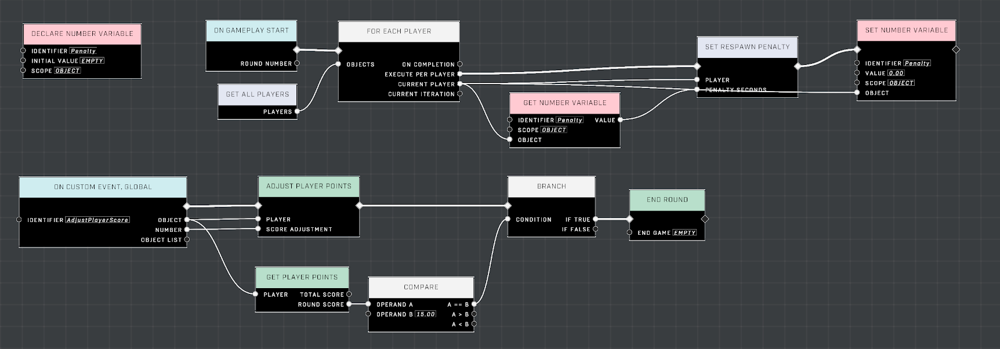
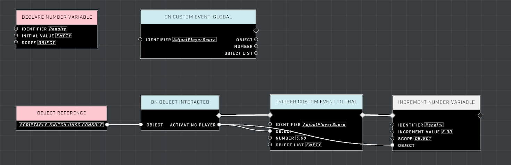

# Using Custom Events and Variables Across Mode and Script Brains

With the introduction of mode brains in CU29, it is now possible to export nodegraph scripts as game modes. This allows game mode logic to be entirely separate from the map you're working on. However, there may be situations in which you want to have a mode brain and a script brain communicate with each other. This can be done using custom events and variables.

## Custom Events

When declaring a custom event in a mode brain that should be accessible from a script brain, the custom event will need to be forward declared in the script brain. This is done by adding a custom event declaration to the script brain. When the game mode is loaded in a match, the custom event will be available to the script brain.

It should be noted that when the script brain calls the custom event on the mode brain, the forward declaration on the script brain will be executed as well. So it is important to ensure that the forward declaration has no nodes connected to its execution pin.

## Variables

When declaring a variable in a mode brain that should be accessible from a script brain, the variable will need to be declared in the script brain as well. This is done by adding a variable declaration to the script brain. When the game mode is loaded in a match, the variable will be available to the script brain.

It should be taken into account that it's not set whether the script brain or the mode brain's nodegraph will be initialized first. This means that if both variable declarations have different default values, it will be unpredictable which value will be used. The ideal way of setting a default value is to set it in one of the brains via an event like _On Game Start_ or _On Gameplay Start_.

## Recommendations

When configuring a mode brain to communicate with a script brain (and vice versa), it is recommended to determine which brain is the source of truth for the custom event or variable. This will help to avoid any confusion when creating logic for each brain. In practice, most use cases will have the mode brain as the source of truth, but it is important to consider the requirements of what you are trying to achieve.

**IMPORTANT** It is not recommended to leave a mode brain or mode prefab on your map when you are ready to test. If you do so and select your exported game mode, there will be two nodegraphs containing the same logic. This may cause unexpected behavior.

## Example

We will create part of a game mode that uses a custom scoring approach configured in the mode brain. There will be various ways for a player to earn points, and various ways to accumulate penalties. At the end of every round, the penalties will be applied to the player's respawn time for the next round. For maps that can be used with this game mode one can imagine map specific ways to earn points and penalties. This is where the script brain comes in.

### Nodegraph

Let's start by creating the mode brain. We will create a custom event that can be called whenever a player earns points. We will also create a variable that will store the player's current respawn penalty to be applied in the next round.

<figure><figcaption></figcaption></figure>

Here we are declaring a global custom event with an identifier of _AdjustPlayuerScore_. We use the provided number parameter to adjust the player's score. We are also declaring an object scope variable with an identifier of _Penalty_. At the start of the round, we are applying the penalty belonging to a given player to their respawn time. We are also resetting the penalty to 0.

Now let's create the script brain. We will forward declare the custom event and declare the variable. We'll also define an event that will give the player bonus points at the cost of incurring a penalty.

<figure><figcaption></figcaption></figure>

Here we are forward declaring the custom event _AdjustPlayerScore_ and declaring the variable _Penalty_. In the previously mentioned event, a scriptable switch has been added to the map, and a static reference is being used declare an _On Object Interacted_ event.

When the the player interacts with the switch, the _AdjustPlayerScore_ event is triggered in the mode brain and the player's score is increaded. The penalty is also increased by 5. At the start of the next round, the player will now have an additional respawn time.

**Contributors**

Mr. Admirals\
Captain Punch
