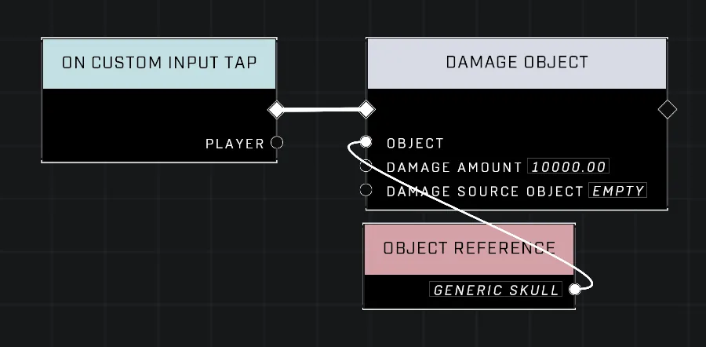
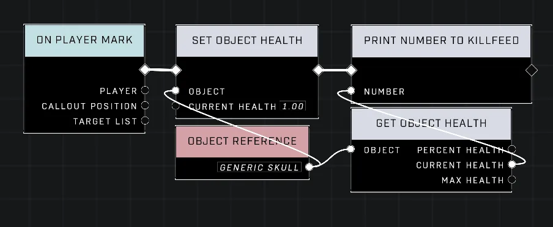

# Skulls And Sandwiches Cause Shock Damage On Destruction

<figure><figcaption></figcaption></figure>

In Halo Infinite, specific items such as the Generic Skull (also known as the Oddball) and various Sandwich objects exhibit unique properties upon being destroyed. These objects release a shock explosion effect similar to that of the Shock Fusion Coil when their health reaches zero.

## Explosion Mechanics and Property Inheritance

The shock explosion triggered on death is a property tied to the Generic [Skull](../../../scripting/nodes/skulls/skull.md)/Oddball object. Other items, such as the Normal Sandwich and Mythic Sandwich, inherit this ability because they are built upon the properties of the Oddball.

### Inherited Shock Effects in Sandwiches

When these objects are destroyed, they release an energy discharge akin to the Shock Fusion Coil's effect. 

<figure><figcaption></figcaption></figure>


This video demonstrates the effect of an object's death causing a shock explosion.


## Destruction Methods and Health Management

The default health for the Generic `Skull`, Normal Sandwich, and Mythic Sandwich is 10,000. There are several ways these objects can be destroyed:

* **Natural Means:** High-velocity impacts or bullet impacts from weaponry.
* **Scripting:** Using the [Damage Object](../../../scripting/nodes/objects/damage-object.md) node to manually reduce an object's health via logic.


The [Set Object Health](../../../scripting/nodes/objects/set-object-health.md) node can be used during scripting to lower the default 10,000 health value, making objects easier for players to destroy using gunfire.


<figure><figcaption></figcaption></figure>


This video shows an object being destroyed by gunfire, resulting in a shock explosion.


***

## Source Data

* Discord thread: [Skulls And Sandwiches Cause Shock Damage On Destruction](https://discord.com/channels/220766496635224065/1538162365441380473/1538162365441380473)

#### <mark style="color:green;">Contributors</mark>

Okom