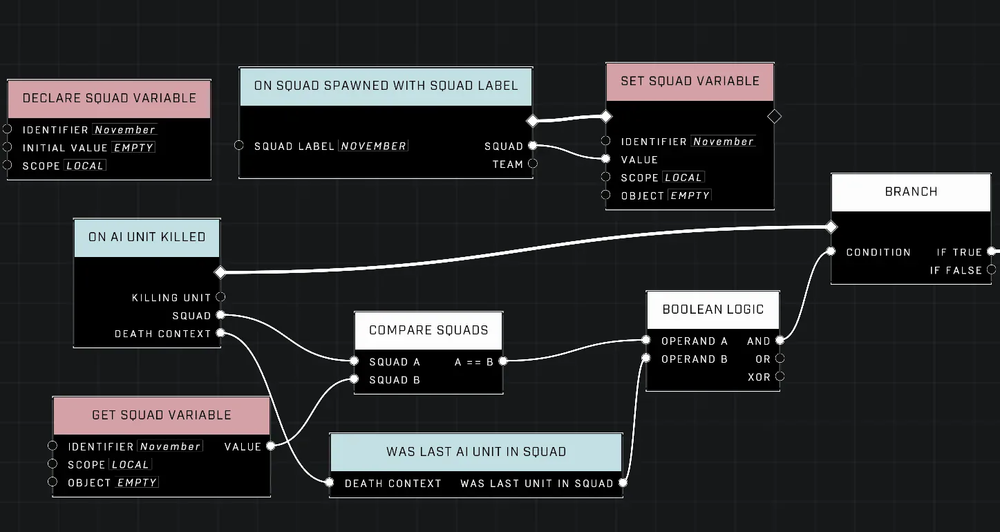
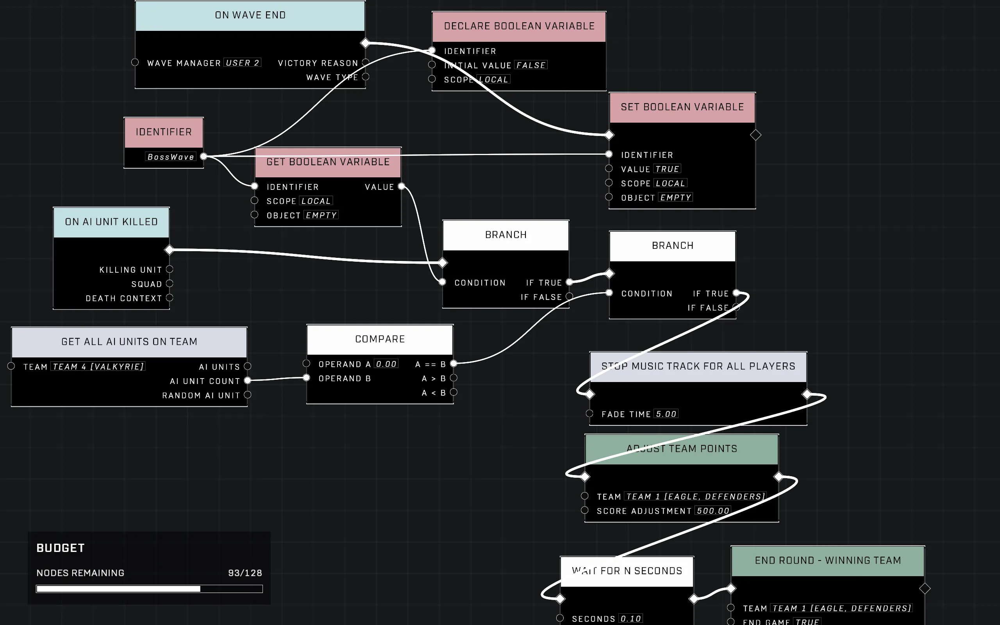

# Triggering Events When All Enemies Are Killed

<figure><figcaption></figcaption></figure>

To trigger gameplay events—such as opening doors or starting the next level stage—once combat has concluded, developers must implement logic that detects when no enemies remain in an area. This can be achieved by monitoring individual unit deaths via squad status or tracking the total count of active units on a specific team.

## Detection Logic Methods

One effective way to determine if an encounter is finished is to check if the last enemy from a group has died and if no other members of that group are still alive.

### Using Squads and Unit Counts

This method combines squad-specific data with general team counts to ensure triggers only occur at the appropriate time. This approach typically requires two specific conditions fed into an `AND` logic node, which then feeds into a [Branch](../../../scripting/nodes/logic/branch.md).

* **Condition A (Squad Check):** Use the [On AI Unit Killed](../../../scripting/nodes/events-ai/on-ai-unit-killed.md) event and plug the "[Was Last AI Unit In Squad](../../../scripting/nodes/death-context/was-last-ai-unit-in-squad.md)" pin from the `Death Context` section into its input.
* **Condition B (Team Count Check):** Use [Get All AI Units On Team](../../../scripting/nodes/ai/get-all-ai-units-on-team.md) to obtain an AI unit count. [Compare](../../../scripting/nodes/logic-compare/compare.md) this using a `Logic Compare (A > B)` node where $B = 0$, and then apply a [Boolean NOT](../../../scripting/nodes/logic/boolean-not.md). This ensures the condition is met only when the remaining unit count on that team is zero.

By combining these with a [Boolean Logic](../../../scripting/nodes/logic/boolean-logic.md) node set to `AND`, you can trigger an event—such as using [Translate Object To Point](../../../scripting/nodes/objects-transform/translate-object-to-point.md) or [Move Object To Transform](../../../scripting/nodes/objects-transform/move-object-to-transform.md) for a door—only when both criteria are satisfied simultaneously.

<figure><figcaption>
Illustrates a setup or result relevant to Triggering Events When All Enemies Are Killed and the workflow described in this article.
</figcaption></figure>

### Using Team Assignments for Reliability

For these detection methods to work correctly, enemy AI spawners must be assigned to a specific team (for example, Team 4). If the spawners are set to neutral, enemies may not be detectable by various scripting logic checks or sensor equipment.

<figure><figcaption>
Illustrates a setup or result relevant to Triggering Events When All Enemies Are Killed and the workflow described in this article.
</figcaption></figure>


To avoid triggering events prematurely when enemies are still spawning, use a Boolean variable as a "guard." Only activate the logic described above once you have explicitly set that Boolean to `True` (for example, after all spawners in an area have been triggered).


## Managing Combat with Wave Managers

For complex encounters where enemies should spawn sequentially or at specific intervals, utilizing a [Wave](../../../scripting/nodes/ai-waves/wave.md) Manager is often more efficient than manual unit counting.

### Sequential and Gradual Spawning

The `Wave Scripts` system can be used to organize spawners into groups that trigger simultaneously. However, if you require enemies to spawn gradually—for instance, waiting for one group to die before the next appears—you should avoid grouping all spawners in a single simultaneous wave. Instead, separate them into individual chains using:

* An `Add Wave` node
* A `Wave` node
* [Wave Options](../../../scripting/nodes/ai-waves/wave-options.md) nodes
* An `Object List` of spawners

This structure allows you to control the timing and flow of combat more precisely than a single large wave.

### End Conditions for Waves

The [On Wave End](../../../scripting/nodes/events-ai/on-wave-end.md) event can be used to trigger actions once a specific set of enemies has been dealt with. To ensure the script recognizes which specific wave is being processed, match the "User" selection (e.g., User 2) across your `Add Wave`, `Wave`, and `On Wave End` nodes.

***

## Source Data

* Discord thread: [Triggering Events When All Enemies Are Killed](https://discord.com/channels/220766496635224065/1510700438138257450/1510700438138257450)

#### <mark style="color:green;">Contributors</mark>

Halloween\
swagonflyyyy\
seanonix\
Guild Archivist