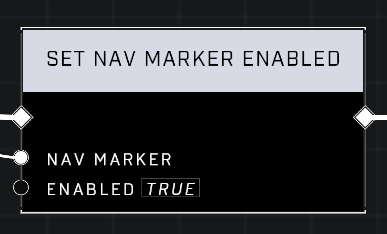
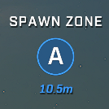

# UI Nav Markers need to be Enabled each round

<figure><figcaption></figcaption></figure>

While UI Nav Markers are useful for guiding players to objectives, they may appear to stop functioning when a new round begins. This behavior is typically resolved by re-enabling the markers for the new round.

## Managing Marker Visibility

### Re-enabling via Scripting

To ensure markers are visible in subsequent rounds, the [Set Nav Marker Enabled](../../../scripting/nodes/ui-nav-markers/set-nav-marker-enabled.md) node must be used.

<figure><figcaption>
The `Set [Nav Marker](../../../scripting/nodes/ui-nav-markers/nav-marker.md) Enabled` node is used to refresh the visibility of navigation markers between rounds.
</figcaption></figure>

## Maintaining Marker References


Lists of UI Nav Markers built during the game start phase persist across rounds and do not need to be cleared or rebuilt.


Because these lists remain accessible, players can continue to use the same references in every round by simply re-enabling them using the appropriate node.

<figure><figcaption>
A UI `Nav Marker` displays the name of a spawn zone and its distance.
</figcaption></figure>

***

## Source Data

* Discord thread: [UI Nav Markers need to be Enabled each round](https://discord.com/channels/220766496635224065/1422050068667826237/1422050068667826237)

#### <mark style="color:green;">Contributors</mark>

Okom