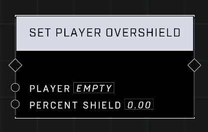
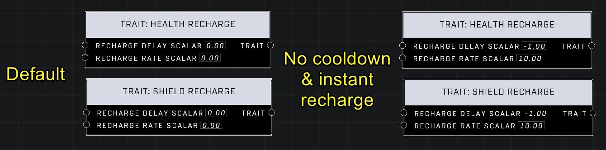
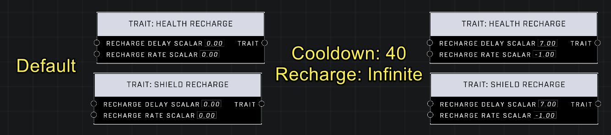

# Restore Player Shield Instantly

<figure><figcaption></figcaption></figure>

Players can achieve near-instant shield restoration through either direct maximization via the overshield system or by manipulating recharge properties using trait nodes.

## Instant Shield Maximization

The `Set Player Overshield` node can be used to return a player's shield to its maximum value immediately. Because this node always sets the player shield back to max before applying any overshield, setting the `Percent Shield` value to `0.00` results in an instant restoration of the maximum shield level without adding any additional overshield.

<figure><figcaption>
The Set Player Overshield node can be used with a Percent Shield value of 0.00 to maximize shield instantly.
</figcaption></figure>

## Rapid Shield Recharge Traits

An alternative method involves using the `Trait: Shield Recharge` node to trigger a nearly instantaneous recharge of approximately 0.2 seconds. This approach utilizes the game's inherent recharge mechanics rather than a direct value set.

### Scalar Behavior and Timing

The behavior of the recharge is determined by two specific scalars: the `Recharge Delay Scalar` and the `Recharge Rate Scalar`. These values influence both shield and health properties.

| Setting | Recharge Delay Scalar | Recharge Rate Scalar | Resulting Shield Recharge |
| --- | --- | --- | --- |
| Default | 0.00 | 0.00 | 2.0000 s |
| Optimized | -1.00 | 10.00 | 0.2000 s |
| Extreme | 7.00 or higher | -1.00 | Infinite (assumed) |

<figure><figcaption>
Using specific scalars in the Trait: Shield Recharge node allows for a nearly instantaneous shield recharge.
</figcaption></figure>

<figure><figcaption>
High delay scalars and negative rate scalars can be used to create extremely long cooldowns and infinite recharge times.
</figcaption></figure>


The scalars used for shield recharge also impact health recharge timing. For example, optimized settings result in a Shield Recharge of 0.2 seconds and a Health Recharge of 0.1 seconds.


### Required Trait Workflow

To implement the trait-based recharge, a specific sequence of nodes must be used to apply and then clean up the effect.


To use this method, declare a trait set with the shield recharge trait using the `Declare Trait Set` node, apply it to a player using the `Apply Player Trait Set` node, and ensure you use the `Remove Player Trait Set` node once the desired recharge has finished.


***

## Source Data

* Discord thread: [Restore Player Shield Instantly](https://discord.com/channels/220766496635224065/1478032097200574626/1478032097200574626)

#### <mark style="color:green;">Contributors</mark>

Okom