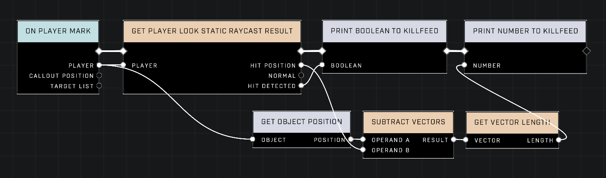
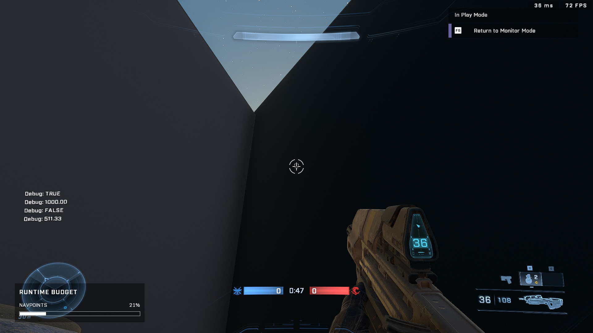

# Player Look Static Raycast Max Distance

<figure><figcaption></figcaption></figure>

The `Get Player Look Static Raycast Result` node has a specific distance limitation that affects how it reports successful collisions.

## Raycast Distance Limits

The [Get Player Look Static Raycast Result](../../../scripting/nodes/math/get-player-look-static-raycast-result.md) node returns `TRUE` on the Hit Detected pin only when a collision is found within a distance of 1000.00 units.


Any object located beyond 1000.00 units from the player will result in a `FALSE` output from the Hit Detected pin.


<figure><figcaption>
This node graph shows the logic used to calculate distances between the player and the raycast result.
</figcaption></figure>

## Hit Position Behavior

When the raycast fails to detect a hit, the node provides a default hit position of 0,0,0.

### Identifying Null Hits

Because the default hit position is the world origin, developers can identify a failed raycast by checking the distance between the player and the returned hit position. If the measured distance matches the player's current distance to the map origin (0,0,0), it indicates that no hit was detected within the functional 1000.00 unit range.

<figure><figcaption>
The debug text displays a distance value that indicates the player is measuring the distance to the world origin rather than a hit object.
</figcaption></figure>

***

## Source Data

* Discord thread: [Player Look Static Raycast Max Distance](https://discord.com/channels/220766496635224065/1451609883165331609/1451609883165331609)

#### <mark style="color:green;">Contributors</mark>

Okom