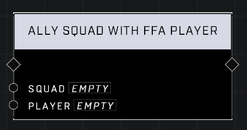

# Ally Squad With FFA Player

## Description
Makes the AI units in the Squad friendly to the Player and assigns them the same FFA allegiance as the Player. Leave the Player empty to break the alliance and remove the AI units' FFA allegiance. Has no effect in Team games.

## Node Type
Nodes fall into two basic categories: Data and Execution. This node Executes a function directly in the node string.

## Inputs
| Input | Type | Required | Description |
|------------------|------------------|----------|--------------------------------------------------------------|
| Squad | Squad | Yes      | The squad that will ally with player.  |
| Player | Object | Yes | The player that the squad will ally with.  |

## Outputs
| Output | Type | Description |
|------------------|------------------|--------------------------------------------------------------|
| N/A | N/A | N/A |

\
\
**Contributors**

AddiCt3d 2CHa0s