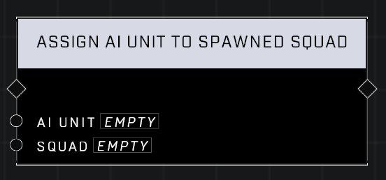

# Assign AI Unit To Spawned Squad

## Description
Assigns the AI Unit to the spawned Squad

## Node Type
Nodes fall into two basic categories: Data and Execution. This node Executes a function directly in the node string.

## Inputs
| Input            | Type             | Required | Description												    |
|------------------|------------------|----------|--------------------------------------------------------------|
| AI Unit | Object | Yes | The AI Unit to be assigned to a Squad.  |
| Squad | Squad | Yes | The Squad that the AI Unit will be assigned to. |

## Outputs
| Output           | Type             | Description												     |
|------------------|------------------|--------------------------------------------------------------|
| N/A | N/A | N/A |

\
\
**Contributors**

AddiCt3d 2CHa0s