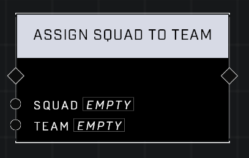

# Assign Squad To Team

## Description
Assigns the Squad to the Team

## Node Type
Nodes fall into two basic categories: Data and Execution. This node Executes a function directly in the node string.

## Inputs
| Input            | Type             | Required | Description												    |
|------------------|------------------|----------|--------------------------------------------------------------|
| Squad | Squad | Yes | Squad that will be assigned a team. |
| Team | Team | Yes | Team the Squad will be assigned to. |

## Outputs
| Output           | Type             | Description												     |
|------------------|------------------|--------------------------------------------------------------|
| N/A | N/A | N/A |

\
\
**Contributors**

AddiCt3d 2CHa0s