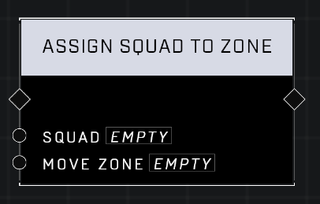

# Assign Squad To Zone

## Description
Assigns the Squad to the Move Zone

## Node Type
Nodes fall into two basic categories: Data and Execution. This node Executes a function directly in the node string.

## Inputs
| Input            | Type             | Required | Description												    |
|------------------|------------------|----------|--------------------------------------------------------------|
| Squad | Squad | Yes      | The Squad being assigned a Move Zone. |
| Move Zone | Move Zone | Yes | The Move Zone the Squad will be assigned to. |

## Outputs
| Output           | Type             | Description												     |
|------------------|------------------|--------------------------------------------------------------|
| N/A | N/A | N/A |

\
\
**Contributors**

AddiCt3d 2CHa0s