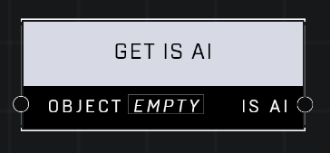

# Get Is AI

## Description
Returns true of the Object is an AI unit

## Node Type
Nodes fall into two basic categories: Data and Execution. This node supplies Data for an Execution node.

## Inputs
| Input            | Type             | Required | Description												    |
|------------------|------------------|----------|--------------------------------------------------------------|
| Object | Object | Yes | Object to check if it's an AI.|

## Outputs
| Output           | Type             | Description												     |
|------------------|------------------|--------------------------------------------------------------|
| Is AI | Boolean | Output will be TRUE if object is an AI, FALSE if not. |

\
\
**Contributors**

AddiCt3d 2CHa0s