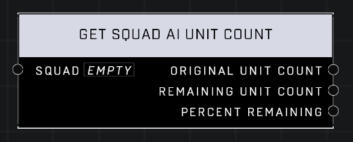

# Get Squad AI Unit Count

## Description
Returns the Original Unit Count of a Squad and its Remaining Unit Count as a number or percentage

## Node Type
Nodes fall into two basic categories: Data and Execution. This node supplies Data for an Execution node.

## Inputs
| Input            | Type             | Required | Description												    |
|------------------|------------------|----------|--------------------------------------------------------------|
| Squad | Squad | Yes | Squad to use to get AI Count.|

## Outputs
| Output           | Type             | Description												     |
|------------------|------------------|--------------------------------------------------------------|
| Original Unit Count | Number | Total number of AI Units that spawned with squad. |
| Remaining Unit Count | Number | Total number of AI Units in squad that are still alive. |
| Percent Remaining | Number | Percent of AI Units in squad that are still alive. |

\
\
**Contributors**

AddiCt3d 2CHa0s