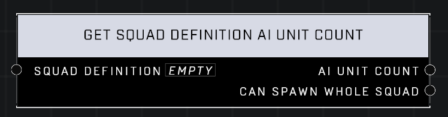

# Get Squad Definition AI Unit Count

## Description
Returns the number of AI units contained in the Squad Definition and checks if the whole squad can be spawned

## Node Type
Nodes fall into two basic categories: Data and Execution. This node supplies Data for an Execution node.

## Inputs
| Input            | Type             | Required | Description												    |
|------------------|------------------|----------|--------------------------------------------------------------|
| Squad Definition | Squad Definition | Yes | The Squad Definition to use to count AI that currently have it. |

## Outputs
| Output           | Type             | Description												     |
|------------------|------------------|--------------------------------------------------------------|
| AI Unit Count | Number | Count of AI Units with selected Squad Definition. |
| Can Spawn Whole Squad | Boolean | If TRUE, the Squad with this definition can be spawned again. |

\
\
**Contributors**

AddiCt3d 2CHa0s