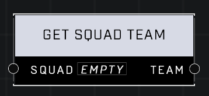

# Get Squad Team

## Description
Returns the Team that the Squad is on

## Node Type
Nodes fall into two basic categories: Data and Execution. This node supplies Data for an Execution node.

## Inputs
| Input            | Type             | Required | Description												    |
|------------------|------------------|----------|--------------------------------------------------------------|
| Squad | Squad | Yes | Squad to get Team from. |

## Outputs
| Output           | Type             | Description												     |
|------------------|------------------|--------------------------------------------------------------|
| Team | Team | Team the Squad is assigned to. |

\
\
**Contributors**

AddiCt3d 2CHa0s