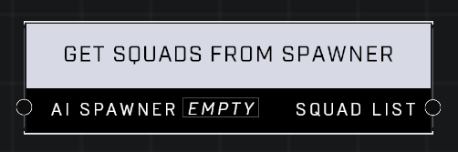

# Get Squads From Spawner

## Description
Returns a *Squad List* containing all currently-spawned squads that came from the *AI Spawner*. The order of list entries is random.

## Node Type
Nodes fall into two basic categories: Data and Execution. This node supplies Data for an Execution node.

## Inputs
| Input            | Type             | Required | Description												    |
|------------------|------------------|----------|--------------------------------------------------------------|
| AI Spawner       | Object           | Yes      | The AI Spawner to get squads from.						    |

## Outputs
| Output           | Type             | Description												                           |
|------------------|------------------|------------------------------------------------------------------------------------|
| Squad List       | List             | A randomly ordered list of currently-spawned squads that came from the AI Spawner. |

\
\
**Contributors**

Mr. Admirals\
AddiCt3d 2CHa0s
