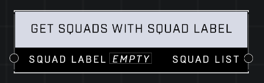

# Get Squads With Squad Label

## Description
Returns a Squad List containing all Squads that have the Squad Label. The order of list entries is random. 

## Node Type
Nodes fall into two basic categories: Data and Execution. This node supplies Data for an Execution node.

## Inputs
| Input            | Type             | Required | Description												    |
|------------------|------------------|----------|--------------------------------------------------------------|
| Squad Label | Squad Label | Yes | The Squad Label to use to get Squads. |

## Outputs
| Output           | Type             | Description												     |
|------------------|------------------|--------------------------------------------------------------|
| Squad List | Generic List | List of Squads using the specified Squad Label. |

\
\
**Contributors**

AddiCt3d 2CHa0s