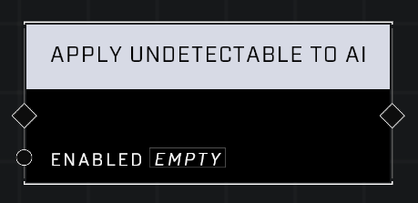

# Apply Undetectable To AI

## Description
Sets the Undetectable To AI game option according to Enabled

## Node Type
Nodes fall into two basic categories: Data and Execution. This node Executes a function directly in the node string.

## Inputs
| Input            | Type             | Required | Description												    |
|------------------|------------------|----------|--------------------------------------------------------------|
| Enabled | Boolean | Yes | If TRUE Undetectable to AI is enabled, if FALSE it is not.

## Outputs
| Output           | Type             | Description												     |
|------------------|------------------|--------------------------------------------------------------|
| N/A | N/A | N/A |

\
\
**Contributors**

AddiCt3d 2CHa0s