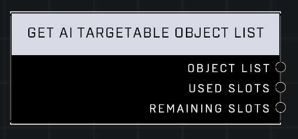

# Get AI Targetable Object List

## Description
Gets a list of the current Objects that can be targeted by AI, as well as the number of Used and Remaining slots in that list

## Node Type
Nodes fall into two basic categories: Data and Execution. This node supplies Data for an Execution node.

## Inputs
| Input            | Type             | Required | Description												    |
|------------------|------------------|----------|--------------------------------------------------------------|
| N/A | N/A | N/A | N/A |

## Outputs
| Output           | Type             | Description												     |
|------------------|------------------|--------------------------------------------------------------|
| Object List | Object List | List of all AI Targetable objects.|
| Used Slots | Number | How many AI Targetable objects are currently being used.|
| Remaining Slots | Number | How many AI Targetable objects can be added to the list.|

\
\
**Contributors**

AddiCt3d 2CHa0s