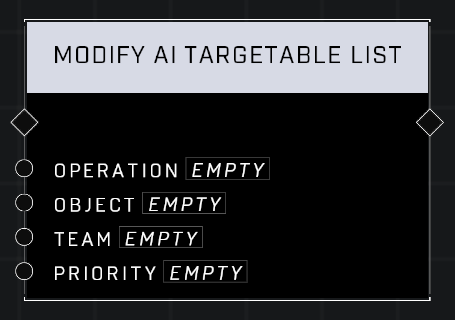

# Modify AI Targetable List

## Description
Adds or removes an Object that can be targetable by AI, who will perceive it to be on a Team and will prioritize attacking it based off Priority. The priority value can be negative which reduces the likelihood of being attacked by AI.

## Node Type
Nodes fall into two basic categories: Data and Execution. This node Executes a function directly in the node string.

## Inputs
| Input            | Type             | Required | Description												    |
|------------------|------------------|----------|--------------------------------------------------------------|
| Operation | Add/Remove | Yes | Whether to add or remove the Object from the list.|
| Object | Object | Yes | The object being added or removed from targetable list.|
| Team | Team | No | Which team the object is assigned to.|
| Priority | Number (-9.5-1) | No | The Priority this object has for it's enemies.|

## Outputs
| Output           | Type             | Description												     |
|------------------|------------------|--------------------------------------------------------------|
| N/A | N/A | N/A |

\
\
**Contributors**

AddiCt3d 2CHa0s