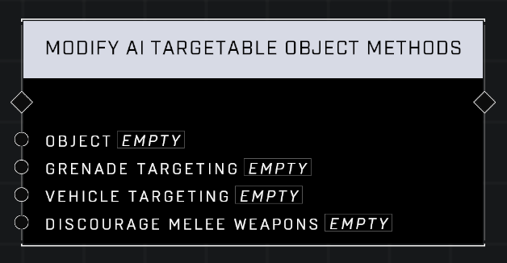

# Modify AI Targetable Object Methods

## Description
Sets whether an Object that is currently registered to be targetable by AI can be attacked by grenades and vehicles. Attacks with melee weapons can also be discouraged.

## Node Type
Nodes fall into two basic categories: Data and Execution. This node Executes a function directly in the node string.

## Inputs
| Input            | Type             | Required | Description												    |
|------------------|------------------|----------|--------------------------------------------------------------|
| Object | Object | Yes | The object in the AI Targetable list that is being modified.|
| Grenade Targeting | Boolean | Yes | Whether or not AI will attack Object with grenades.|
| Vehicle Targeting | Boolean | Yes | Whether or not AI will attack Object with vehicles.|
| Discourage Melee Weapons | Boolean | Yes | Whether or not AI will prioritize melee when attacking the Object.|

## Outputs
| Output           | Type             | Description												     |
|------------------|------------------|--------------------------------------------------------------|
| N/A | N/A | N/A |

\
\
**Contributors**

AddiCt3d 2CHa0s