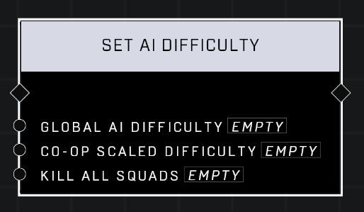

# Set AI Difficulty

## Description
Changes Global AI Difficulty, ranging from Easy to Legendary, and Co-op Scaled Difficulty, which scales difficulty based off the number of players. Only newly-spawned squads will have the new difficulty, so the node can optionally Kill All Squads to ensure difficulties match.

## Node Type
Nodes fall into two basic categories: Data and Execution. This node Executes a function directly in the node string.

## Inputs
| Input            | Type             | Required | Description												    |
|------------------|------------------|----------|--------------------------------------------------------------|
| Global AI Difficulty | Easy / Heroic / Legendary / Normal | Yes | Sets difficulty level for all AI in the game. |
| Co-op Scaled Difficulty | Dynamic / Four Players / Many Players / One Player / Two Players | Yes | Sets difficulty of all AI based off number of players in the game.|
| Kill All Squads | Boolean | Yes | Whether or not to kill all currently existing AI that have old difficulty settings.|

## Outputs
| Output           | Type             | Description												     |
|------------------|------------------|--------------------------------------------------------------|
| N/A | N/A | N/A |

\
\
**Contributors**

AddiCt3d 2CHa0s