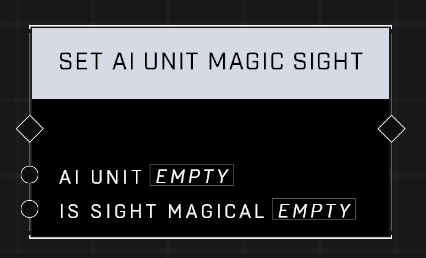

# Set AI Unit Magic Sight

## Description
Sets the Magic Sight behavior on an AI Unit

## Node Type
Nodes fall into two basic categories: Data and Execution. This node Executes a function directly in the node string.

## Inputs
| Input            | Type             | Required | Description												    |
|------------------|------------------|----------|--------------------------------------------------------------|
| AI Unit | Object | Yes | The AI Unit to set Magic Sight for.|
| Is Sight Magical | Boolean | Yes | If set to TRUE, AI has Magic Sight, if FALSE AI does not.

## Outputs
| Output           | Type             | Description												     |
|------------------|------------------|--------------------------------------------------------------|
| N\A | N\A | N\A |

\
\
**Contributors**

AddiCt3d 2CHa0s