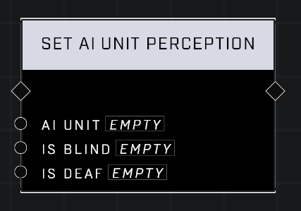

# Set AI Unit Perception

## Description
Sets the Deaf and Blind behaviors on an AI Unit

## Node Type
Nodes fall into two basic categories: Data and Execution. This node Executes a function directly in the node string.

## Inputs
| Input            | Type             | Required | Description												    |
|------------------|------------------|----------|--------------------------------------------------------------|
| AI Unit | Object | Yes | The AI Unit to set Perception for.|
| Is Blind | Boolean | Yes | If set to TRUE, AI is Blind, if FALSE AI is not. |
| Is Deaf | Boolean | Yes | If set to TRUE, AI is Deaf, if FALSE AI is not. |

## Outputs
| Output           | Type             | Description												     |
|------------------|------------------|--------------------------------------------------------------|
| N\A | N\A | N\A |

\
\
**Contributors**

AddiCt3d 2CHa0s