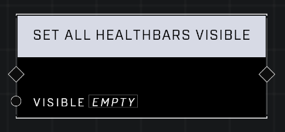

# Set All Healthbars Visible

## Description
Sets the visibility of healthbars on all AI units

## Node Type
Nodes fall into two basic categories: Data and Execution. This node Executes a function directly in the node string.

## Inputs
| Input            | Type             | Required | Description												    |
|------------------|------------------|----------|--------------------------------------------------------------|
| Visible | Boolean | Yes | If TRUE, all AI healthbars are visible. If FALSE, all AI healthbars are not visible.|

## Outputs
| Output           | Type             | Description												     |
|------------------|------------------|--------------------------------------------------------------|
| N\A | N\A | N\A |

\
\
**Contributors**

AddiCt3d 2CHa0s