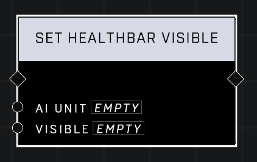

# Set Healthbar Visible

## Description
Sets the visibility of a healthbar on an AI unit

## Node Type
Nodes fall into two basic categories: Data and Execution. This node Executes a function directly in the node string.

## Inputs
| Input            | Type             | Required | Description												    |
|------------------|------------------|----------|--------------------------------------------------------------|
| AI Unit | Object | Yes | The AI Unit to set healthbar visibility for.|
| Visible | Boolean | Yes | If TRUE, AI's healthbar is visible. If FALSE, AI's healthbar is not visible.|

## Outputs
| Output           | Type             | Description												     |
|------------------|------------------|--------------------------------------------------------------|
| N\A | N\A | N\A |

\
\
**Contributors**

AddiCt3d 2CHa0s