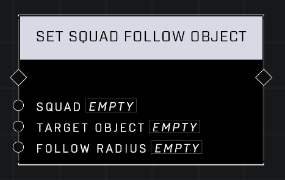

# Set Squad Follow Object

## Description
Forces a Squad to follow the Target Object. The Follow Radius defines the area around the object that the Squad must stay in.

## Node Type
Nodes fall into two basic categories: Data and Execution. This node Executes a function directly in the node string.

## Inputs
| Input            | Type             | Required | Description												    |
|------------------|------------------|----------|--------------------------------------------------------------|
| Squad | Squad | Yes | AI in this Squad will attempt to follow the object.|
| Target Object | Object | Yes | The Object that the Squad will attempt to follow.|
| Follow Radius | Number (-10000 - 10000)| Yes | AI in the Squad outside of this radius will not follow.|

## Outputs
| Output           | Type             | Description												     |
|------------------|------------------|--------------------------------------------------------------|
| N\A | N\A | N\A |

\
\
**Contributors**

AddiCt3d 2CHa0s