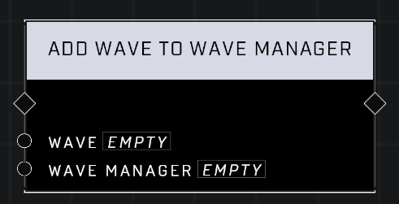

# Add Wave To Wave Manager

## Description
Adds a wave to the queue of a Wave Manager, which automatically spawns waves until its queue is empty. There can be up to 8 wave managers running simultaneously.

## Node Type
Nodes fall into two basic categories: Data and Execution. This node Executes a function directly in the node string.

## Inputs
| Input            | Type             | Required | Description												    |
|------------------|------------------|----------|--------------------------------------------------------------|
| Wave | Wave | Yes | The Wave that is being added to the Wave Manager.|
| Wave Manager | Wave Manager | Yes | Which Wave Manager to add the Wave to.|

## Outputs
| Output           | Type             | Description												     |
|------------------|------------------|--------------------------------------------------------------|
| N/A | N/A | N/A |

\
\
**Contributors**

AddiCt3d 2CHa0s