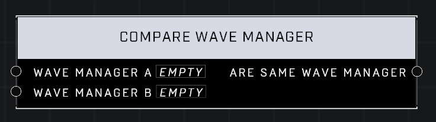

# Compare Wave Manager

## Description
Compares two Wave Manager values

## Node Type
Nodes fall into two basic categories: Data and Execution. This node supplies Data for an Execution node.

## Inputs
| Input            | Type             | Required | Description												    |
|------------------|------------------|----------|--------------------------------------------------------------|
| Wave Manager A | Wave Manager | Yes | A Wave Manager that you are checking is the same. |
| Wave Manager B | Wave Manager | Yes | A Wave Manager that you are checking is the same. |

## Outputs
| Output           | Type             | Description												     |
|------------------|------------------|--------------------------------------------------------------|
| Are Same Wave Manager | Boolean | If both Wave Managers are the same the output will be TRUE, otherwise it will be FALSE.|

\
\
**Contributors**

AddiCt3d 2CHa0s
