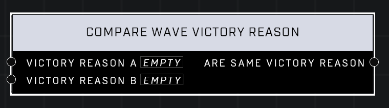

# Compare Wave Victory Reason

## Description
Compares two Victory Reason values

## Node Type
Nodes fall into two basic categories: Data and Execution. This node supplies Data for an Execution node.

## Inputs
| Input            | Type             | Required | Description												    |
|------------------|------------------|----------|--------------------------------------------------------------|
| Victory Reason A | Victory Reason | Yes | A Victory Reason that you are checking is the same. (Custom 1-8, Extermination, and Duration)|
| Victory Reason B | Victory Reason | Yes | A Victory Reason that you are checking is the same. (Custom 1-8, Extermination, and Duration)|

## Outputs
| Output           | Type             | Description												     |
|------------------|------------------|--------------------------------------------------------------|
| Are Same Victory Reason | Boolean | If both Victory Reasons are the same the output will be TRUE, otherwise it will be FALSE. |

\
\
**Contributors**

AddiCt3d 2CHa0s
