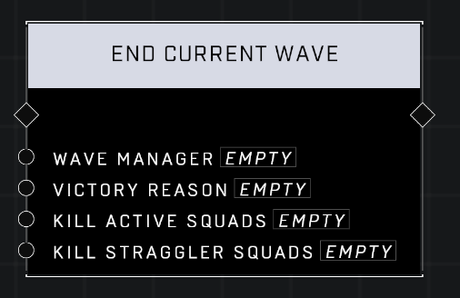

# End Current Wave

## Description
Ends the current wave, optionally killing the Active Squads from the current wave and Straggler Squads left over from previous waves

## Node Type
Nodes fall into two basic categories: Data and Execution. This node Executes a function directly in the node string.

## Inputs
| Input            | Type             | Required | Description												    |
|------------------|------------------|----------|--------------------------------------------------------------|
| Wave Manager | Wave Manager | Yes | The Wave Manager that will stop spawning squads.|
| Victory Reason | Victory Reason | Yes | The Victory Reason that the wave was ended. (Custom 1-8, Extermination, Duration)|
| Kill Active Squads | Boolean | Yes | Whether or not to kill any currently remaining AI from this wave.|
| Kill Straggler Squads | Boolean | Yes | Whether or not to kill any currently remaining AI from other waves.|

## Outputs
| Output           | Type             | Description												     |
|------------------|------------------|--------------------------------------------------------------|
| N/A | N/A | N/A |

\
\
**Contributors**

AddiCt3d 2CHa0s

