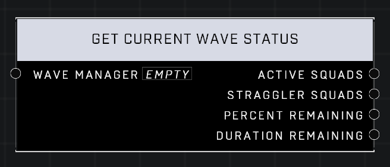

# Get Current Wave Status

## Description
Returns the Active Squads, Percent Remaining, and Duration Remaining in the current wave, along with any Straggler Squads that are left over from previous waves

## Node Type
Nodes fall into two basic categories: Data and Execution. This node supplies Data for an Execution node.

## Inputs
| Input            | Type             | Required | Description												    |
|------------------|------------------|----------|--------------------------------------------------------------|
| Wave Manager | Wave Manager | Yes | The Wave Manager that will be used to get status. |

## Outputs
| Output           | Type             | Description												     |
|------------------|------------------|--------------------------------------------------------------|
| Active Squads | Generic List | List of Squads in the Wave Manager that have AI currently spawned on the map.|
| Straggler Squads | Generic List | List of Squads that are in other Wave Managers that have AI currently spawned on the map.|
| Percent Remaining | Number | What percent of the input Wave Manager that hasn't been spawned in yet.|
| Duration Remaining | Number | If Duration was set for the Wave, outputs how many seconds before the Wave ends.|

\
\
**Contributors**

AddiCt3d 2CHa0s
