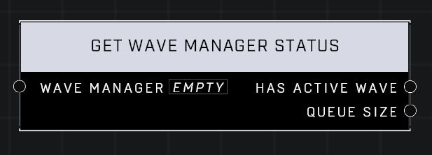

# Get Wave Manager Status

## Description
Returns whether the Wave Manager has an active wave. The Queue Size includes the active wave.

## Node Type
Nodes fall into two basic categories: Data and Execution. This node supplies Data for an Execution node.

## Inputs
| Input            | Type             | Required | Description												    |
|------------------|------------------|----------|--------------------------------------------------------------|
| Wave Manager | Wave Manager | Yes | The Wave Manager to use for status. |

## Outputs
| Output           | Type             | Description												     |
|------------------|------------------|--------------------------------------------------------------|
| Has Active Wave | Boolean | TRUE if the Wave Manager currently has an active wave, FALSE if not.|
| Queue Size | Number | Count of Waves in the Wave Manager that hasn't been cleared yet.|

\
\
**Contributors**

AddiCt3d 2CHa0s